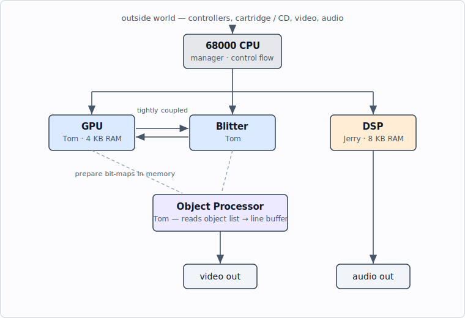

<!-- nav:top -->
[🏠 Atari Jaguar Developer Reference](../index.md) ▸ Architecture & Memory ▸ **System Architecture Overview**
<!-- /nav:top -->

# System Architecture Overview

The Atari Jaguar is a custom chip set intended as the heart of a high-performance
games machine. Beyond a general-purpose CPU, it provides **five processing
elements** spread across two custom ASICs.

> **Source:** *Software Reference Manual — Tom & Jerry* (V10), pp. 6–10;
> *Technical Overview* (V10), pp. 3, 9; *Appendix* (Atari original, 26 April
> 1995), Appendices A & B. Originally © Atari Corp. 1995.

## The two custom chips

| Chip | Code name | Contains |
|------|-----------|----------|
| **Tom** | graphics ASIC | Object Processor, Graphics Processor (GPU), Blitter, memory controller, video timing |
| **Jerry** | sound/I-O ASIC | Digital Sound Processor (DSP), timers, serial interfaces, joystick interface |

Alongside them sits an **external CPU — a Motorola 68000** — which acts as the
system manager.

## The five processors

1. **CPU (68000)** — the *manager*. Handles communication with the outside world
   and coordinates the other processors. It sits at the highest level of control
   flow and has complete control of the system. It is **not** the performance
   path; heavy lifting belongs to the coprocessors.

2. **Object Processor** *(in Tom)* — generates the display. For each scan line it
   executes a list of commands (the **object list**) and assembles that line into
   an internal line buffer. Objects can be scaled/unscaled bit-maps, can perform
   conditional branches within the list, and can interrupt the GPU. It is both a
   sprite engine and a framebuffer system. See
   [Object Processor](../tom/object-processor.md).

3. **Graphics Processor (GPU)** *(in Tom)* — a very fast RISC microprocessor
   optimized for graphics generation, with 4 KB of fast internal RAM, a parallel
   multiplier, a barrel shifter, and a divide unit. Executes in parallel with the
   other units. See [Graphics Processor](../tom/gpu.md).

4. **Blitter** *(in Tom)* — tightly coupled to the GPU; moves and fills graphical
   data 64 bits at a time, with hardware Gouraud shading, Z-buffering, line
   drawing, character painting, and image rotation. See [Blitter](../tom/blitter.md).

5. **Digital Sound Processor (DSP)** *(in Jerry)* — architecturally similar to the
   GPU but aimed at sound synthesis and sampled-sound playback, with 8 KB of fast
   internal RAM. Can also be used for general processing. See [DSP](../jerry/dsp.md).

## How they cooperate

- The **CPU** manages the system and feeds the coprocessors.
- The **GPU + Blitter** typically work together to render bit-maps into memory.
- The **Object Processor** reads the object list and composites those bit-maps
  into the displayed scan lines.
- The **DSP** runs independently for audio, tightly coupled to Jerry's timers and
  interrupts.

## Memory and the data path

The Jaguar gives these blocks a **64-bit data path** to external memory and can
sustain a very high transfer rate into DRAM. Main system RAM is 64 bits wide: a
single 2 MB bank starting at `$00000000`. Hardware registers and the GPU/DSP
internal SRAM live higher in the map (GPU/DSP RAM from `$00F00000`).

> The GPU, DSP, and Blitter internal registers are **32 bits wide and must be read
> and written as 32-bit entities** by the 68000. Transfers to GPU/DSP internal
> SRAM must be long-word aligned. To clear a long in internal RISC RAM, use `move`,
> **not** `clr.l` (which is unreliable there — a documented hardware bug).

Full details: [Memory Map / Register List](memory-map.md).

## Bus bandwidth and performance

All five processors share the single 64-bit bus, so **memory bandwidth — not raw
clock speed — is usually the limiting factor.** Atari's own programming
guidelines reduce to a few rules:

- **ROM is slow — up to ~10× slower than DRAM.** Do not run 68000 code, build or
  read an [object list](../tom/object-processor.md#programming-the-object-list),
  or display bitmap data directly from ROM. Copy code and data into RAM first; an
  object list run from ROM may slow dramatically or fail outright.
- **Keep the 68000 off the bus.** It is the system manager, not the performance
  path. When idle, halt it with `STOP` so the Object Processor, Blitter, GPU, and
  DSP get the bus. For time-critical 68000 routines (e.g. a vertical-blank
  handler), copy them to RAM and execute there so instruction fetches don't hog
  the bus. See [GPU → Performance notes](../tom/gpu.md#performance-notes-community).
- **Move memory with the Blitter,** not the 68000/GPU/DSP, and use the Blitter in
  **phrase mode** wherever possible — it is much faster. You can start a blit and
  keep computing on the GPU or DSP until it completes.
- **Run the GPU and DSP concurrently;** offload as much as possible from the
  68000 onto them.
- **Minimize interrupt-handler time** — optimize all interrupt code to the
  absolute minimum, since it steals bus cycles from everything else.

> **Source:** *Appendix* (Atari original, 26 April 1995), Appendix A and Appendix
> B ("Programming Tips & General Procedures").

## Two color resolutions

Tom supports **24-bit** (true color) and **16-bit** modes. The 16-bit modes
include **CRY** (Cyan-Red-Intensity), which is cheap to Gouraud-shade and nearly
indistinguishable from 24-bit. See [CRY Color & Color Mapping](../tom/color-cry.md).

## See also

- [Memory Map / Register List](memory-map.md)
- [Video & System Clocks, Timing](video-clocks-timing.md)
- [CD-ROM Subsystem Overview](../cdrom/overview.md)
- [Glossary](../reference/glossary.md)

<!-- nav:bottom -->
---

◀ **Prev:** [Home](../index.md) &nbsp;·&nbsp; 🏠 **[Home](../index.md)** &nbsp;·&nbsp; **Next:** [Memory Map / Register List](memory-map.md) ▶

**Jump to:** [Memory Map](memory-map.md) · [Registers](../reference/register-list.md) · [Instructions](../reference/risc-instruction-set.md) · [Glossary](../reference/glossary.md) · [CD-ROM](../cdrom/overview.md)
<!-- /nav:bottom -->
