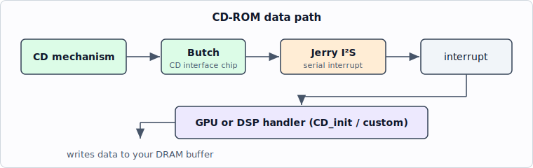

<!-- nav:top -->
[🏠 Atari Jaguar Developer Reference](../index.md) ▸ CD-ROM Subsystem ▸ **CD-ROM Hardware**
<!-- /nav:top -->

# CD-ROM Hardware

The Jaguar CD-ROM drive module: its place in the system, the Butch interface
chip, the data path into Jerry, and the available schematics.

> **Source:** *Jaguar CD-ROM* developer manual (scanned), © Atari Corp. 1995
> (drive specs, Butch chip, data path); `sources/Schematics/Jaguar CD ROM.pdf` and
> `sources/Other Documents/Jag CD testpro4.pdf` (schematic / test spec). The 1995 manual
> documents the drive only as far as is needed for software development — direct
> hardware access is **not** supported (use the [CD BIOS](bios-api.md)).

## The drive module

The Jaguar CD is an external add-on that sits on the cartridge/expansion port and
provides a double-speed CD mechanism. Key specs (see
[Overview](overview.md#what-the-jaguar-cd-is) for the full table):

| Property | Value |
|----------|-------|
| Capacity | 746.9 MB |
| Speed | Double speed, ≈353 kb/sec |
| Sustained rate | 352,800 bytes/sec |
| Block size | 2352 bytes (588 longs) |
| Uncorrectable error rate | < 1 in 10¹¹ (all errors flagged) |

The 1994 *Jaguar CD-ROM Drive Module Test Specification* (`sources/Other Documents/Jag CD testpro4.pdf`)
is a manufacturing document (in-circuit test, static burn-in, PCBA functional
test, diagnostics) rather than a programming reference — useful only for
hardware/repair work.

## Butch — the CD interface chip

CD data enters the Jaguar through the **Butch** interface chip, which redirects
the CD data stream onto **Jerry's I²S serial interrupt**. This is why the
[CD BIOS](bios-api.md#reading-data-24) loads GPU (or DSP) interrupt code to
service those interrupts, and why you must not enable unrelated `JINTCTRL`
interrupts while a read handler is active.

Two revisions exist and they affect which BIOS you can run:

| Chip | BIOS support | Identifying it |
|------|--------------|----------------|
| **Butch 1** | CD BIOS rev 2 only | older development CD systems |
| **Butch 2** | rev 2 **or** rev 4 | CD system in a modified production-level case |

See [Calling convention](bios-api.md#calling-convention) for how the BIOS revision is selected.

## Data path

- **GPU path** (the `CD_init` family): the BIOS installs a GPU ISR that runs off
  the redirected Jerry I²S interrupt. Tight latency budget (~54 µs usable at
  double speed) — see [the latency rule](programming-guide.md#reading-data-reliably).
- **DSP path** (optional): your own DSP I²S handler with `CD_jeri` and
  `SMODE = $14`; subject to rare unreported data errors, so checksum critical
  data.
- **Audio path:** `CD_jeri` can route CD data straight to Jerry's I²S so audio
  enters without consuming main system bandwidth (see
  [Audio Subsystem](../jerry/audio.md)).

Relevant registers (`SMODE`, the I²S serial registers, `JINTCTRL`) are documented
in the [Memory Map / Register List](../architecture/memory-map.md) and
[Serial I/O](../jerry/serial-io.md).

## Schematics

- **`sources/Schematics/Jaguar CD ROM.pdf`** — the CD-ROM unit schematic
  (`JAGCDROM.SCH`, Atari Corporation). It is a multi-sheet schematic referencing
  sub-sheets `DROPOUT.SCH`, `SERVO.SCH`, etc., covering the RF/servo/laser front
  end and the digital interface. The PDF carries the net/title-block data but is
  a drawing, not prose — open it directly for pin-level detail.
- The main **Jaguar console schematic** (`sources/Schematics/Jaguar Schemaic (Clear).pdf`
  / `.png`) shows the cartridge/expansion port the CD module attaches to; see
  [Video & System Clocks, Timing → ports](../architecture/video-clocks-timing.md).

## See also

- [CD-ROM Subsystem Overview](overview.md)
- [CD-ROM BIOS API](bios-api.md)
- [Serial I/O — ComLynx, MIDI, Synchronous Serial](../jerry/serial-io.md)
- [Audio Subsystem & Synthesis](../jerry/audio.md)
- [Memory Map / Register List](../architecture/memory-map.md)

<!-- nav:bottom -->
---

◀ **Prev:** [CD-ROM Programming Procedures & Guidelines](programming-guide.md) &nbsp;·&nbsp; 🏠 **[Home](../index.md)** &nbsp;·&nbsp; **Next:** [Sample Programs](../examples/sample-programs.md) ▶

**Jump to:** [Architecture](../architecture/overview.md) · [Memory Map](../architecture/memory-map.md) · [Registers](../reference/register-list.md) · [Instructions](../reference/risc-instruction-set.md) · [Glossary](../reference/glossary.md) · [CD-ROM](overview.md)
<!-- /nav:bottom -->
