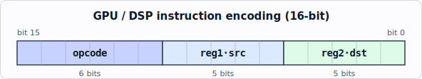
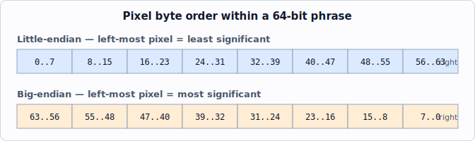

<!-- nav:top -->
[🏠 Atari Jaguar Developer Reference](../index.md) ▸ Reference ▸ **RISC Instruction Set (GPU/DSP)**
<!-- /nav:top -->

# RISC Instruction Set (GPU/DSP)

The Jaguar's two RISC processors — the GPU (Tom) and the DSP (Jerry) — share a single 16-bit instruction set. Most instructions are common to both processors; a handful are GPU-only (pixel pack/unpack, saturation, phrase load/store) or DSP-only (modulo arithmetic, mirror, MAC saturation), and these are flagged in the table below.

> **Source:** *Software Reference Manual — Tom & Jerry* (V10), pp. 89–106. © Atari Corp. 1995.

**On this page:** [Instruction encoding](#instruction-encoding) · [Flags](#flags) · [Register usage](#register-usage) · [Instruction set](#instruction-set) · [Writing fast GPU/DSP programs](#writing-fast-gpu-and-dsp-programs) · [Data organisation (endianness)](#data-organisation--big-and-little-endian)

## Instruction Encoding

GPU and DSP instructions are all sixteen bits, laid out as follows:



- **opcode** defines the instruction to be executed.
- **reg2** is the destination operand, or the only operand of single-operand instructions.
- **reg1** is the source operand.

The reg2 and reg1 fields usually hold a register number but have other meanings in some instructions. The assembly syntax is:

```
<Op code name> <Source> <Destination>
```

> **Note:** To remain compatible with future versions of the Jaguar chipset, always clear the reg1 field of single-operand instructions and leave both fields of `NOP` cleared.

## Flags

The description of each instruction indicates how it affects the flags. The flags are valid when the result is written (see *Writing Fast GPU and DSP Programs*).

| Flag | Name | Meaning |
| --- | --- | --- |
| **Z** | Zero | Generally set when the result is zero. |
| **N** | Negative | Generally set when the result is negative (bit 31 of the result). |
| **C** | Carry | Carry out of an adder, borrow out of a subtract, or a shifted-out bit, depending on the instruction. |

A flag noted as "not defined" must not be relied upon after that instruction. Instructions that note "ZNC – unaffected" leave all three flags at their previous values.

## Register Usage

The register-usage notes for each instruction show where it uses a register port. **Cycle 1** is the clock cycle at which the instruction is considered to be "executing" and is generally the pipeline stage at which its register operands are read. It is the only pipeline stage occupied by `NOP`. Where an instruction affects the flags, those flags are valid at the clock cycle when the result is written.

There are two banks of 32 registers each. `MOVEFA`/`MOVETA` transfer between the active bank and the alternate bank. `R14` and `R15` serve as index/base registers for the indexed and base-offset load/store forms. `R15` is also used as the stack-style index. Indexed-address offsets are expressed in **long words**, not bytes (divide any byte/label offset by four).

## Instruction Set

Opcodes below are shown as `$XX` (the instruction number from the source "No." column, in hex). Operand notation: `Rn` = register, `n` = immediate data, `cc` = condition code, `(Rn)` = memory at the address in `Rn`.

The **GPU** and **DSP** columns indicate which processor implements each instruction: ✅ = available, ❌ = not available. Most instructions run on both; the GPU-only set (pixel `PACK`/`UNPACK`, the `SAT*` saturations, phrase `LOADP`/`STOREP`) and the DSP-only set (`ADDQMOD`/`SUBQMOD` modulo arithmetic, `MIRROR`, `SAT32S`) are the exceptions.

| Mnemonic | GPU | DSP | Operands | Description | Flags | Opcode | Cycles (Register Usage) |
| --- | :-: | :-: | --- | --- | --- | --- | --- |
| ABS | ✅ | ✅ | Rn | 32-bit integer absolute value. Same effect as NEG if the operand is negative, otherwise does nothing. Does not work for value $80000000, which is left unchanged with N set. | Z – set if result is zero; N – cleared; C – set if the operand was negative | `$16` | C1: dest read; C2: dest write |
| ADD | ✅ | ✅ | Rn,Rn | 32-bit two's-complement integer add; result = dest + source, written to dest. | Z – set if result zero; N – set if result negative; C – carry out of adder | `$00` | C1: source & dest read; C3: dest write |
| ADDC | ✅ | ✅ | Rn,Rn | 32-bit two's-complement add with carry in from the previous carry flag, otherwise like ADD. | Z – set if result zero; N – set if result negative; C – carry out of adder | `$01` | C1: source & dest read; C3: dest write |
| ADDQ | ✅ | ✅ | n,Rn | 32-bit two's-complement add where the source field is immediate data in the range 1–32, otherwise like ADD. | Z – set if result zero; N – set if result negative; C – carry out of adder | `$02` | C1: dest read; C3: dest write |
| ADDQMOD | ❌ | ✅ | n,Rn | **(DSP only)** Add with quick data using modulo arithmetic. Like ADDQ, except result bits may be unmodified data where the corresponding modulo-register bits are set — enables circular-buffer management for 2ⁿ-size buffers (high modulo bits set, low bits clear). | Z – set if result zero; N – set if result negative; C – carry out of adder | `$3F` | C1: dest read; C3: dest write |
| ADDQT | ✅ | ✅ | n,Rn | 32-bit two's-complement add like ADDQ, except transparent to the flags (they retain their previous values). | ZNC – unaffected | `$03` | C1: dest read; C3: dest write |
| AND | ✅ | ✅ | Rn,Rn | 32-bit logical AND of source and dest, written back to dest. | Z – set if result zero; N – set if result negative; C – not defined | `$09` | C1: source & dest read; C3: dest write |
| BCLR | ✅ | ✅ | n,Rn | Clear the bit in dest selected by the immediate source field (range 0–31). Other bits unaffected. | Z – set if all dest bits are zero; N – from bit 31 of result; C – not defined | `$0F` | C1: dest read; C3: dest write |
| BSET | ✅ | ✅ | n,Rn | Set the bit in dest selected by the immediate source field (range 0–31). Other bits unaffected. | Z – set if result zero; N – set if result negative; C – not defined | `$0E` | C1: dest read; C3: dest write |
| BTST | ✅ | ✅ | n,Rn | Test the bit in dest selected by the immediate source field (range 0–31). | Z – set if the selected bit is zero; N – not defined; C – not defined | `$0D` | C1: dest read; C3: flags valid |
| CMP | ✅ | ✅ | Rn,Rn | 32-bit compare. Same as SUB without storing the result; flags reflect the comparison (equality and magnitude). | Z – set if result zero (operands equal); N – set if result negative (source > dest); C – borrow out of subtract | `$1E` | C1: source & dest read; C3: flags valid |
| CMPQ | ✅ | ✅ | n,Rn | 32-bit compare against immediate data in the range −16 to +15. | Z – set if result zero (operands equal); N – set if result negative (immediate > dest); C – borrow out of subtract | `$1F` | C1: dest read; C3: flags valid |
| DIV | ✅ | ✅ | Rn,Rn | Unsigned divide: 32-bit unsigned dividend in dest ÷ 32-bit unsigned divisor in source → 32-bit unsigned quotient in dest. Remainder is available; can also divide 16.16 unsigned values. | ZNC – unaffected | `$15` | C1: source & dest read; C18: dest write |
| IMACN | ✅ | ✅ | Rn,Rn | Signed integer multiply/accumulate, no write-back. Like IMULT, but the 32-bit product is added to the result of the previous arithmetic operation and is not written back. Used after IMULTN to form a multiply/accumulate group. | ZNC – unaffected | `$14` | C1: source & dest read |
| IMULT | ✅ | ✅ | Rn,Rn | 16-bit signed integer multiply; 32-bit result = signed product of the bottom 16 bits of source and dest, written back to dest. | Z – set if result zero; N – set if result negative; C – not defined | `$11` | C1: source & dest read; C3: dest write |
| IMULTN | ✅ | ✅ | Rn,Rn | Like IMULT, but the result is not written back. Intended as the first of a multiply/accumulate group (speed advantage in not writing back). | Z – set if result zero; N – set if result negative; C – not defined | `$12` | C1: source & dest read |
| JR | ✅ | ✅ | cc,n | Jump relative to (address of next instruction + signed immediate source field), range +15 / −16 words. Condition codes encoded as for JUMP. Neither processor will reliably execute `jr`/`jump` unless running from internal RAM. | ZNC – unaffected | `$35` | C1: flags must be valid |
| JUMP | ✅ | ✅ | cc,(Rn) | Jump absolute to the location pointed to by the source register; the destination field holds the condition code. Condition bits (ANDed if more than one set): bit 0 – Z must be clear; bit 1 – Z must be set; bit 2 – flag selected by bit 4 must be clear; bit 3 – flag selected by bit 4 must be set; bit 5 – if set select N flag, if clear select C. *(bit-4 selector per source; bit 5 chooses N vs C)* | ZNC – unaffected | `$34` | C1: flags must be valid |
| LOAD | ✅ | ✅ | (Rn),Rn | Load long: 32-bit memory read. Source holds a long-word-aligned 32-bit byte address; data loaded into dest. | ZNC – unaffected | `$29` | C1: source read; Cn: dest write (internal cycle 3/4, external subject to bus latency) |
| LOAD | ✅ | ✅ | (R14+n),Rn | Load long, indexed. As LOAD, address = R14 + immediate source field (range 1–32). Offset is in long words (divide label arithmetic by four). Slower than LOAD (two-tick address overhead). | ZNC – unaffected | `$2B` | C1: R14 read; Cn: dest write (internal cycle 5/6, external subject to bus latency) |
| LOAD | ✅ | ✅ | (R15+n),Rn | Load long, indexed via R15. As above. | ZNC – unaffected | `$2C` | C1: R15 read; Cn: dest write (internal cycle 5/6, external subject to bus latency) |
| LOAD | ✅ | ✅ | (R14+Rn),Rn | Load long from register with base offset: address = R14 + source register (should be long-word aligned). Otherwise like the indexed forms. | ZNC – unaffected | `$3A` | C1: R14 & source read; Cn: dest write (internal cycle 5/6, external subject to bus latency) |
| LOAD | ✅ | ✅ | (R15+Rn),Rn | Load long, base offset via R15. As above. | ZNC – unaffected | `$3B` | C1: R15 & source read; Cn: dest write (internal cycle 5/6, external subject to bus latency) |
| LOADB | ✅ | ✅ | (Rn),Rn | Load byte: 8-bit memory read. Source holds a 32-bit byte address; byte loaded into bits 0–7, remainder zeroed. External memory only — internal memory performs a 32-bit read. | ZNC – unaffected | `$27` | C1: source read; Cn: dest write (external subject to bus latency) |
| LOADW | ✅ | ✅ | (Rn),Rn | Load word: 16-bit memory read. Source holds a word-aligned 32-bit byte address; word loaded into bits 0–15, remainder zeroed. External memory only — internal memory performs a 32-bit read. | ZNC – unaffected | `$28` | C1: source read; Cn: dest write (external subject to bus latency) |
| LOADP | ✅ | ❌ | (Rn),Rn | **(GPU only)** Load phrase: 64-bit memory read. Source holds a phrase-aligned 32-bit byte address; low long-word loaded into dest, high long-word available in the high half register. External memory only — internal memory performs a 32-bit read. | ZNC – unaffected | `$2A` | C1: source read; Cn: dest write (external subject to bus latency) |
| MIRROR | ❌ | ✅ | Rn | **(DSP only)** Mirror the register: bit 0→31, bit 1→30, bit 2→29, etc. Helpful for FFT address generation. | Z – set if result zero; N – set if result negative; C – not defined | `$30` | C1: dest read; C3: dest write |
| MMULT | ✅ | ✅ | Rn,Rn | Matrix multiply: start systolic matrix-element multiply; source register locates the source matrix, product written into dest. Flags reflect the final multiply/accumulate. (DSP matrix multiplies work only in the lower 4K of DSP RAM; matrix register addresses only the first 4K — only address lines 2–11 are programmable, the rest hard-wired to `$F1Bxxx`.) | Z – set if result zero; N – set if result negative; C – carry out of adder | `$36` | See discussion of multiply/accumulate |
| MOVE | ✅ | ✅ | Rn,Rn | 32-bit register-to-register transfer. | ZNC – unaffected | `$22` | C1: source read; C2: dest write |
| MOVE | ✅ | ✅ | PC,Rn | Load dest with the address of the current instruction (adjusted for pipelining/prefetch). Only way for the GPU/DSP to read its own PC. | ZNC – unaffected | `$33` | C2: dest write |
| MOVEFA | ✅ | ✅ | Rn,Rn | Move from alternate register: 32-bit transfer, source lies in the other bank of 32 registers. | ZNC – unaffected | `$25` | C1: source read; C2: dest write |
| MOVEI | ✅ | ✅ | n,Rn | Move immediate: 32-bit register load from the next 32 bits of the instruction stream (first word = low word, second = high word). | ZNC – unaffected | `$26` | C3: dest write |
| MOVEQ | ✅ | ✅ | n,Rn | Move quick data: 32-bit register load with immediate value in the range 0–31. | ZNC – unaffected | `$23` | C2: dest write |
| MOVETA | ✅ | ✅ | Rn,Rn | Move to alternate register: 32-bit transfer, dest lies in the other bank of 32 registers. | ZNC – unaffected | `$24` | C1: source read; C2: dest write |
| MTOI | ✅ | ✅ | Rn,Rn | Mantissa to integer: extract mantissa and sign from the IEEE 32-bit float in source and create a signed integer in dest (MSB is bit 32, sign-extended). | Z – set if result zero; N – set if result negative; C – not defined | `$37` | C1: source read; C3: dest write |
| MULT | ✅ | ✅ | Rn,Rn | 16-bit unsigned integer multiply; 32-bit result = unsigned product of the bottom 16 bits of source and dest, written back to dest. | Z – set if result zero; N – set if bit 31 of result is one; C – not defined | `$10` | C1: source read; C3: dest write |
| NEG | ✅ | ✅ | Rn | 32-bit two's-complement negate: result = 0 − dest, written back to dest. $80000000 cannot be negated. | Z – set if result zero; N – set if result negative; C – borrow out of subtract | `$08` | C1: source read; C3: dest write |
| NOP | ✅ | ✅ | — | Do nothing. Leave both operand fields cleared. | ZNC – unaffected | `$39` | none |
| NORMI | ✅ | ✅ | Rn,Rn | Normalisation integer: gives the amount by which the source (an unsigned integer) should be shifted right to normalise it (value may be negative); also the amount to add to the exponent to account for normalisation. | Z – set if result zero; N – set if result negative; C – not defined | `$38` | C1: source read; C3: dest write |
| NOT | ✅ | ✅ | Rn | Logical NOT: 32-bit invert; result = $FFFFFFFF XOR dest, written back to dest. *(source prints "NOR" as the mnemonic; described as logical invert / NOT)* | Z – set if result zero; N – set if result negative; C – not defined | `$0C` | C1: dest read; C3: dest write |
| OR | ✅ | ✅ | Rn,Rn | 32-bit logical OR of source and dest, written back to dest. | Z – set if result zero; N – set if result negative; C – not defined | `$0A` | C1: source & dest read; C3: dest write |
| PACK | ✅ | ❌ | Rn | **(GPU only)** Pack an unpacked pixel value into a 16-bit CRY pixel: bits 22–25 → 12–15; bits 13–16 → 8–11; bits 0–7 → 0–7. Set reg1 = 0 to differentiate from UNPACK. | ZNC – unaffected | `$3F` | C1: dest read; C3: dest write |
| RESMAC | ✅ | ✅ | Rn | Multiply/accumulate result write: write the current contents of the result register to the indicated register. Intended as the final instruction of a multiply/accumulate group. | ZNC – unaffected | `$13` | C3: dest write |
| ROR | ✅ | ✅ | Rn,Rn | 32-bit rotate right by the bottom 5 bits of source. Can be used for ROL by complementing the value. | Z – set if result zero; N – set if result negative; C – bit 31 of the un-shifted data | `$1C` | C1: source & dest read; C3: dest write |
| RORQ | ✅ | ✅ | n,Rn | Rotate right by immediate count (range 1–32). | Z – set if result zero; N – set if result negative; C – bit 31 of the un-shifted data | `$1D` | C1: dest read; C3: dest write |
| SAT8 | ✅ | ❌ | Rn | **(GPU only)** Saturate a 32-bit signed integer to an 8-bit unsigned integer: <0 → 0, >255 → 255. Useful for computed intensities. | Z – set if result zero; N – cleared; C – not defined | `$20` | C1: dest read; C3: dest write |
| SAT16 | ✅ | ❌ | Rn | **(GPU only)** Saturate a 32-bit signed integer to a 16-bit unsigned integer: <0 → 0, >65535 → 65535. Useful for computed Z, audio values. | Z – set if result zero; N – cleared; C – not defined | `$21` | C1: dest read; C3: dest write |
| SAT16S | ✅ | ❌ | Rn | **(GPU only)** Saturate a 32-bit signed integer to a 16-bit signed integer: clamps below $8000 to that value, above $7FFF to that value. *(opcode prints as 33/`$21` in source, same number as SAT16)* | Z – set if result zero; N – cleared; C – not defined | `$21` | C1: dest read; C3: dest write |
| SAT24 | ✅ | ❌ | Rn | **(GPU only)** Saturate a 32-bit signed integer to a 24-bit unsigned integer: <0 → 0, >16,777,215 → 16,777,215. Useful for computed intensities. | Z – set if result zero; N – cleared; C – not defined | `$3E` | C1: dest read; C3: dest write |
| SAT32S | ❌ | ✅ | Rn | **(DSP only)** Saturate multiply/accumulate result: saturate a 40-bit signed value (using the MAC overflow bits as the top 8 bits) to a 32-bit signed integer: clamps below $80000000 to that, above $7FFFFFFF to that. *(opcode prints as 42/`$2A` in source)* | Z – set if result zero; N – set if result negative; C – not defined | `$2A` | C1: dest read; C3: dest write |
| SH | ✅ | ✅ | Rn,Rn | Shift: 32-bit shift left or right by the value in source. A positive value shifts right; magnitude ≥32 gives zero; zero is shifted in. | Z – set if result zero; N – set if result negative; C – bit 0 of un-shifted data (right shift) or bit 31 (left shift) | `$17` | C1: source & dest read; C3: dest write |
| SHA | ✅ | ✅ | Rn,Rn | Shift arithmetic: as SH but right shift is arithmetic (sign shifted in). | Z – set if result zero; N – set if result negative; C – bit 0 of un-shifted data (right) or bit 31 (left) | `$1A` | C1: source & dest read; C3: dest write |
| SHARQ | ✅ | ✅ | n,Rn | Shift arithmetic right by immediate count: as SHRQ but arithmetic (sign shifted in). | Z – set if result zero; N – set if result negative; C – bit 0 of the un-shifted data | `$1B` | C1: dest read; C3: dest write |
| SHLQ | ✅ | ✅ | n,Rn | Shift left by immediate count (range 1–32). Otherwise like SH. (Encoded as 32−n; handled by the assembler.) | Z – set if result zero; N – set if result negative; C – bit 31 of the un-shifted data | `$18` | C1: dest read; C3: dest write |
| SHRQ | ✅ | ✅ | n,Rn | Shift right by immediate count: as SHLQ but shift right, zero shifted in. | Z – set if result zero; N – set if result negative; C – bit 0 of the un-shifted data | `$19` | C1: dest read; C3: dest write |
| STORE | ✅ | ✅ | Rn,(Rn) | Store long: 32-bit memory write. Source holds a long-word-aligned 32-bit byte address; dest holds the data to be written. | ZNC – unaffected | `$2F` | C1: source & dest read |
| STORE | ✅ | ✅ | Rn,(R14+n) | Store long, indexed. As STORE, with address generation as the equivalent indexed LOAD. | ZNC – unaffected | `$31` | C1: R14 read; C2: source read |
| STORE | ✅ | ✅ | Rn,(R15+n) | Store long, indexed via R15. As above. | ZNC – unaffected | `$32` | C1: R15 read; C2: source read |
| STORE | ✅ | ✅ | Rn,(R14+Rn) | Store long to register with base-offset address: address = R14 + dest register (should be long-word aligned). Otherwise like the indexed forms. | ZNC – unaffected | `$3C` | C1: R14 & dest read; C2: source read |
| STORE | ✅ | ✅ | Rn,(R15+Rn) | Store long, base offset via R15. As above. | ZNC – unaffected | `$3D` | C1: R15 & dest read; C2: source read |
| STOREB | ✅ | ✅ | Rn,(Rn) | Store byte: 8-bit memory write. Source holds a 32-bit byte address; dest holds the byte in bits 0–7. External memory only — internal memory performs a 32-bit write. | ZNC – unaffected | `$2D` | C1: source & dest read |
| STOREW | ✅ | ✅ | Rn,(Rn) | Store word: 16-bit memory write. Source holds a word-aligned 32-bit byte address; dest holds the word in bits 0–15. External memory only — internal memory performs a 32-bit write. | ZNC – unaffected | `$2E` | C1: source & dest read |
| STOREP | ✅ | ❌ | Rn,(Rn) | **(GPU only)** Store phrase: 64-bit memory write. Source holds a phrase-aligned 32-bit byte address; dest holds the low long-word, high long-word from the high half register. External memory only — internal memory performs a 32-bit write. | ZNC – unaffected | `$30` | C1: source & dest read |
| SUB | ✅ | ✅ | Rn,Rn | 32-bit two's-complement subtract: result = dest − source, written to dest. | Z – set if result zero; N – set if result negative; C – borrow out of subtract | `$04` | C1: source & dest read; C3: dest write |
| SUBC | ✅ | ✅ | Rn,Rn | 32-bit two's-complement subtract with borrow in from the carry flag, otherwise like SUB. | Z – set if result zero; N – set if result negative; C – borrow out of subtract | `$05` | C1: source & dest read; C3: dest write |
| SUBQ | ✅ | ✅ | n,Rn | 32-bit two's-complement subtract where the source field is immediate data in the range 1–32, otherwise like SUB. | Z – set if result zero; N – set if result negative; C – borrow out of subtract | `$06` | C1: dest read; C3: dest write |
| SUBQMOD | ❌ | ✅ | n,Rn | **(DSP only)** Subtract with quick data using modulo arithmetic. Like SUBQ, except result bits may be unmodified data where the corresponding modulo-register bits are set — enables circular-buffer management for 2ⁿ-size buffers. *(opcode prints as 32/`$20` in source)* | Z – set if result zero; N – set if result negative; C – borrow out of subtract prior to modulo masking | `$20` | C1: dest read; C3: dest write |
| SUBQT | ✅ | ✅ | n,Rn | 32-bit two's-complement subtract like SUBQ, except transparent to the flags (they retain their previous values). | ZNC – unaffected | `$07` | C1: dest read; C3: dest write |
| UNPACK | ✅ | ❌ | Rn | **(GPU only)** Unpack a 16-bit CRY pixel into a 32-bit integer: bits 12–15 → 22–25; bits 8–11 → 13–16; bits 0–7 → 0–7; all other bits zeroed. Set reg1 = 1 to differentiate from PACK. | ZNC – unaffected | `$3F` | C1: dest read; C3: dest write |
| XOR | ✅ | ✅ | Rn,Rn | 32-bit logical exclusive OR of source and dest, written back to dest. | Z – set if result zero; N – set if result negative; C – not defined | `$0B` | C1: source & dest read; C3: dest write |

> **Note on opcodes:** Several GPU-only and DSP-only instructions share opcode numbers because they occupy the same opcode slot on the processor where the other variant does not exist (e.g. `PACK`/`UNPACK`/`ADDQMOD` all print as 63 = `$3F`, distinguished by the reg1 field and by processor; `STOREP` and `MIRROR` both print as 48 = `$30`; `SAT32S` and `SAT24`/`SUBQMOD` reuse slots on opposite processors). Values are reproduced exactly as given in the source.

## Writing Fast GPU and DSP Programs

To get the most out of the Atari RISC processors, it is important to avoid wait states. Each processor can execute one instruction per tick in ideal circumstances, but poorly arranged code can drop to around half that rate. A well-written program can usually achieve an instruction throughput of around two-thirds of the peak figure. Tuning the innermost loops is worthwhile.

> See also the [GPU performance notes](../tom/gpu.md#performance-notes-community) for community techniques: halting the 68000 (`STOP #$2000`) to free the bus, and running GPU code from main RAM.

Wait states occur either because an instruction would use a system resource (a register or flag) that is not yet valid, or because it would use a piece of hardware still busy from an earlier operation (such as the external memory interface). The chipset makes significant use of pipelining.

**Wait states are incurred when:**

- An instruction reads a register containing the result of the previous instruction — one tick of wait until the previous operation completes.
- An instruction uses the flags from the previous instruction — one tick of wait until the previous operation completes.
- A result has to be written back and neither register operand of the next instruction matches — one tick of wait while the data is written.
- Two values are to be written back at once — one tick of wait.
- An instruction attempts to use the result of a divide before it is ready — between one and sixteen wait states until the divide unit completes.
- A divide is about to execute and the previous one has not completed — between one and sixteen wait states.
- An instruction reads a register awaiting data from an incomplete memory read — no more than one tick from internal memory, but several ticks from external memory.
- A load or store is about to execute and the memory interface has not finished the previous transfer(s). One internal load/store, or two external load/stores, can be pending without holding up instruction flow.
- After a store with an indexed addressing mode — one tick.
- After a jump or `jr` — three ticks if executing out of internal memory.
- If the next instruction has not been read — only occurs when executing out of external memory.
- During a matrix multiply, if the CPU accesses the internal space of Tom or Jerry (whichever made the call).

### Interleaving

The most common cause of wait states is using a register that was altered by the previous instruction. Reordering independent instructions ("interleaving") removes the dependency stalls. The source gives this example: the naive sequence below incurs wait states after instructions 1, 2, 4 and 5 (10 ticks total):

```asm
    add  r3,r0   ; add offset to X
    shrq #1,r0   ; apply scaling factor
    add  r0,r4   ; add to base
    add  r5,r1   ; add offset to Y
    shrq #1,r1   ; apply scaling factor
    add  r1,r6   ; add to base
```

Interleaved so dependent instructions are spaced apart, the same work incurs no wait states (6 ticks):

```asm
    add  r3,r0   ; add offset to X
    add  r5,r1   ; add offset to Y
    shrq #1,r0   ; apply scaling factor
    shrq #1,r1   ; apply scaling factor
    add  r0,r4   ; add to base
    add  r1,r6   ; add to base
```

### DSP external-write hazard

> The DSP must not do an external write unless it is preceded by an external read that will complete before the write starts. This problem is intermittent and could be missed by testing — be careful in any DSP code that writes to external memory.

```asm
; Example #1 (will NOT work correctly)
    load  (r1),r2
    or    r10,r11
    store r11,(r3)

; Example #2 (works correctly)
    load  (r1),r2
    or    r2,r11
    store r11,(r3)

; Example #3 (fix for Example #1)
    load  (r1),r2
    or    r2,r2
    or    r10,r11
    store r11,(r3)
```

Example #1 fails because nothing forces the load to complete before the store. Example #2 works because the load result (`r2`) is required by the `or`, which stalls until the read completes. Example #3 fixes #1 by inserting a dummy `or r2,r2` that forces the read to complete before the store.

## Data Organisation – Big and Little Endian

The Jaguar system is intended to be usable in either a little-endian (e.g. Intel 80x86) or big-endian (e.g. 680x0) environment. The difference concerns how the bytes of a larger operand are stored in memory.

When storing a long-word, a **big-endian** processor places the most significant byte at byte address 0; a **little-endian** processor places the most significant byte at byte address 3. With 32-bit processors fitted with 32-bit memory this is not an issue, since "byte address" has no meaning to the memory interface. The problem appears only where the data-path width is narrower than the operand width.

> This document adopts the big-endian convention and Motorola operand ordering. Little-endian / Intel conventions could equally have been applied.

### IO Bus Interface

The IO bus interface is **16-bit**. Therefore 32-bit data such as addresses is presented differently between little- and big-endian systems: in effect, the sense of **A1 is inverted** between the two. A big-endian system sees the high word of a long-word at the low address; a little-endian system sees the high word at the high address.

### Co-Processor Bus Interface

The co-processor bus interface is **64-bits wide**, so there is no big/little-endian problem. Graphics-processor programmers should nonetheless always use byte, word, or long-word transfers as appropriate to the operand size, to avoid having to know whether the CPU is big- or little-endian.

### Pixel Organisation

A side effect of endianness is the organisation of pixels within a phrase (64 bits).

**Little-endian:** the left-most pixel is always the least significant; it includes bit 0 — byte 0 in byte-address terms. **Big-endian:** the left-most pixel is always the most significant; it includes bit 63 — byte 0 in byte-address terms.



For an **8-bit-per-pixel** mode:

- In **pixel mode**, the left-most pixel in both systems is at byte address 0.
- In **phrase mode**, the little-endian left-hand pixel is in bits 0–7; the big-endian left-hand pixel is in bits 56–63.

(These modes refer to Blitter operation, described elsewhere.) This difference affects operations that address pixels within a phrase when transferring a whole phrase at once (Blitter Phrase mode).

## See also

- [Graphics Processor (GPU)](../tom/gpu.md)
- [Digital Sound Processor (DSP)](../jerry/dsp.md)
- [System Architecture Overview](../architecture/overview.md)
- [Glossary](glossary.md)

<!-- nav:bottom -->
---

◀ **Prev:** [Complete Register List](register-list.md) &nbsp;·&nbsp; 🏠 **[Home](../index.md)** &nbsp;·&nbsp; **Next:** [Glossary](glossary.md) ▶

**Jump to:** [Architecture](../architecture/overview.md) · [Memory Map](../architecture/memory-map.md) · [Registers](register-list.md) · [Glossary](glossary.md) · [CD-ROM](../cdrom/overview.md)
<!-- /nav:bottom -->
