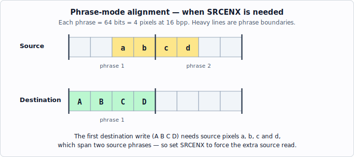
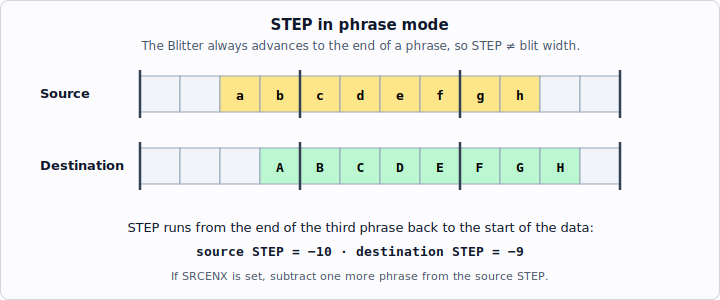

<!-- nav:top -->
[🏠 Atari Jaguar Developer Reference](../index.md) ▸ Tom — Graphics & Video ▸ **Blitter (Tom)**
<!-- /nav:top -->

# Blitter (Tom)

The Blitter (bit block processor) is a hardware engine in Tom for painting and moving blocks of pixels at memory-bandwidth speed, supporting copies, fills, line drawing, rotation/scaling, polygon fills, Gouraud shading and Z-buffering.

> **Source:** *Software Reference Manual — Tom & Jerry* (V10), pp. 56–74; *Technical Overview* (V10), pp. 10–12. © Atari Corp. 1995.

## What is the Blitter?

The Blitter processes, by filling or copying, blocks of bits or pixels. These blocks may be one contiguous piece, or sub-blocks (such as rectangles) within a larger pixel array. It acts as an aid to the GPU: a GPU program processes high-level graphics operations while the Blitter, in parallel, performs the low-level repetitive pixel-by-pixel operations (for example, the GPU calculates polygon coordinates and gradients while the Blitter draws the strips of pixels).

Operations the Blitter can perform:

- simple memory copies
- copies and fills of rectangles within windows
- line-drawing
- image rotation and scaling
- single-scans of polygon fills
- Gouraud shading
- Z-buffering

The Blitter can operate on 1, 2, 4, 8, 16 or 32 bit packed pixels, with considerable flexibility regarding memory layout.

> Unaligned blits in 2 bits-per-pixel mode are unreliable; use 1 bit-per-pixel blits instead.

Its *tour de force* is generating Gouraud-shaded, Z-buffered polygons in 16-bit pixel mode, creating pixels four at a time and writing them at the bus-bandwidth limit, with the GPU calculating Z and intensity gradients and start/stop pixels line-by-line.

## Programming the Blitter

The Blitter is programmed by setting up a description of the required operation in its registers, which are accessible in the system memory map (set by the GPU or an external processor). The registers control three functional blocks: the **address generator**, the **data path**, and the **control logic**.

The programming model (Technical Overview) consists of:

1. Two address generators
2. A Logical Function unit
3. A Pattern Data register
4. A Gouraud Shading unit
5. A Z-buffer unit
6. A collision detection system

The two address generators work in **pixel units**, not address units, greatly simplifying coding.

## Address Generation

The address generator generates an address within a *window* of pixels — a packed array of pixels in memory (often the data of an Object Processor object), described by base address and width. A pointer into the window gives the start position, programmed in terms of X and Y pixel address.

There are two address generation units, **A1** and **A2**, used for the destination and source addresses of copy operations. A1 is normally the destination and A2 the source, though these roles may be reversed. A1 is more sophisticated than A2:

- **A1** can traverse its window in fractional steps with complete independence in X and Y. The inner and outer loops are controlled independently, and the outer-loop increment may contain independent fractional X and Y values. This supports arbitrary **rotation, skewing and scaling** of rectangular areas, using a Digital Differential Analyser (DDA): successive addresses are produced by adding an increment (integer + fractional parts) to the pointer.
- **A2** can repeat a source pattern over a large destination by **masking** the pixel offsets. The mask is logically ANDed with the pointer so it cannot exceed the bounds of a rectangle whose sides are a power-of-two pixels long (any power of two up to 2^15) — e.g. tiling a wall with a repeated brick pattern.

The pointer and increment of A1, in both X and Y, have 16-bit integer parts and 16-bit fractional parts. The outer-loop step value also has integer and fractional parts.

### Windows and address ranges

A window is a rectangle of pixels stored in memory as a linear array of packed phrases, described by a base register and a width/height in pixels. Flags describe pixel size, physical layout, and pointer-update behaviour. The maximum allowed window height is 4096. If no outer loop is used, the window width is irrelevant and the maximum sized blit is 32767 pixels.

The X and Y pointers are 16-bit values, but:

- **Y** is treated as a 12-bit unsigned value; only Y values **0–4095** generate valid addresses (higher-order Y bits ignored).
- **X** is treated as an unsigned 16-bit value, but only values **0–32767** are valid generally.

A1 supports hardware clipping of addresses outside the window; for clipping purposes X and Y are treated as signed 16-bit values.

### Window width (floating-point encoding)

The window width is encoded as a six-bit floating-point value: a four-bit unsigned exponent and a three-bit mantissa whose top bit is implicit, with the point after the implicit top bit (similar to IEEE single precision without the sign bit). It must give a whole number of phrases in the current pixel size. Valid exponent values are 0–11.

Example: width 640 = `1010000000` binary = 1.01 × 2^9, so mantissa = `01` (implicit top bit) and exponent = `1001`, giving width `1001 01`.

Further examples:

| Value | Binary | Floating-point | Encoded |
|-------|--------|----------------|---------|
| 20 | 000000010100 | 1.01 × 2^4 | 010001 |
| 80 | 000001010000 | 1.01 × 2^6 | 011001 |
| 128 | 000010000000 | 1.00 × 2^7 | 011100 |
| 640 | 001010000000 | 1.01 × 2^9 | 100101 |
| 3584 | 111000000000 | 1.11 × 2^11 | 101111 |

The largest allowed width is 3584; the smallest is one phrase in the current pixel size.

### Allowed width equates

`WID2 WID4 WID6 WID8 WID10 WID12 WID14 WID16 WID20 WID24 WID28 WID32 WID40 WID48 WID56 WID64 WID80 WID96 WID112 WID128 WID160 WID192 WID224 WID256 WID320 WID384 WID448 WID512 WID640 WID768 WID896 WID1024 WID1280 WID1536 WID1792 WID2048 WID2560 WID3072 WID3584`

### Pointer updating

Both address generators update their pointers to describe a raster scan over a rectangle. Along a scan line the pointer is updated either by one pixel or to the next phrase boundary, depending on operating mode. At the end of a scan line the pointer is updated by the **step** value (the X/Y distance to the start of the next scan line). The **inner loop** traverses a scan line (length = block width); the **outer loop** adds the step value (length = block height).

## Data Path

The Blitter has a 64-bit data path with a variety of registers. It can process entire phrases at once, or one pixel at a time. Pixels may be 1, 2, 4, 8, 16 or 32 bits wide and are always packed.

When writing or copying pixels, arbitrary alignment of source and destination is allowed; the Blitter aligns the source to match the destination. For phrase transfers the source and destination pointers need not be aligned to the same point in a phrase — the Blitter automatically aligns source to destination, **but only for pixels of eight bits or larger**. If two source phrases must be read before a destination phrase can be written, the **SRCENX** flag must be set so enough source data is fetched.

There are two source data registers (current and previous source, for alignment) and a destination data register (which can be logically combined with the source, and also restores the destination area when only parts of it are updated). A parallel mechanism exists for Z data: there are two source Z registers and a destination Z register. **Z comparison applies to 16-bit pixel mode only.**

### Write Data

Write data may come from:

- The pattern data register (selected by **PATDSEL**)
- The logic function unit (the **default**)
- Computed Gouraud-shaded data (selected by **GOURD**)

The **ADDDSEL** flag selects the adder output. Write Z may come from source Z or computed Z (**GOURZ** selects computed Z).

Overriding these selections is a mechanism to write back unchanged destination data: if a mode is enabled where data may be inhibited (e.g. bit-to-byte expansion, Z buffering, or pixel sizes < 8 bits), a pre-read of the destination data should be performed.

## Data Comparators

Three data comparators are available:

- **Bit comparator** — for bit-to-pixel expansion. Selects a bit (or group of bits) from the source data register using a counter cleared every time the inner loop is entered; the bit controls whether a pixel is written. It can only produce a mask over an entire phrase in 8-bit pixel mode.
- **Z comparator** — in 16-bit pixel mode, compares the 16-bit unsigned integer Z of the on-screen pixel (destination Z) with the Z about to be written (source Z), preventing the write if the on-screen pixel has higher priority.
- **Data comparator** — provides block copies with transparent colours, and assists flood fill via searches. Compares pixel values in 8- or 16-bit pixel modes. Normally compares source data with pattern data, but may compare destination data with pattern data (**CMPDST**).

The comparators achieve three effects:

1. When painting pixels one at a time, a comparator output can inhibit the write of a pixel, leaving the previous value unchanged.
2. When painting a phrase at a time, the comparator outputs can force the destination data to be written back (unchanged if previously read, or a background colour if not).
3. The Blitter action can be stopped altogether (collision detection, searching, etc.).

## Bus Interface

The Blitter accesses memory through the 64-bit co-processor bus, cycling it at a rate limited only by external memory speed, with a one-tick overhead when turning round from a read to a write. All external memory is viewed as phrase-wide; the memory controller expands transfers for narrower physical layouts. The Blitter requests the bus at the start of an operation and does not stop requesting until the entire operation completes; higher-priority bus masters can suspend it.

---

## Register Description

All address registers are 32 bits unless otherwise indicated. All data registers are 64 bits unless otherwise noted. Data registers may only be written while the Blitter is idle.

### Address Registers

| Equate | Address | Access | Description |
|--------|---------|--------|-------------|
| A1_BASE | $F02200 | WO | A1 base address (must be phrase aligned) |
| A1_FLAGS | $F02204 | WO | A1 control flags |
| A1_CLIP | $F02208 | WO | A1 clipping size |
| A1_PIXEL | $F0220C | RW | A1 pixel pointer (X low word, Y high word) |
| A1_STEP | $F02210 | WO | A1 step integer part (X low, Y high; signed 16-bit) |
| A1_FSTEP | $F02214 | WO | A1 step fractional part |
| A1_FPIXEL | $F02218 | RW | A1 pixel pointer fraction (X low, Y high) |
| A1_INC | $F0221C | WO | A1 increment integer part (X low, Y high; signed 16-bit) |
| A1_FINC | $F02220 | WO | A1 increment fractional part |
| A2_BASE | $F02224 | WO | A2 base address (must be phrase aligned) |
| A2_FLAGS | $F02228 | WO | A2 control flags |
| A2_MASK | $F0222C | WO | A2 address mask (window AND-mask when Mask flag set) |
| A2_PIXEL | $F02230 | RW | A2 pixel pointer (X low word, Y high word) |
| A2_STEP | $F02234 | WO | A2 step integer part (X low, Y high; signed 16-bit) |

**A1_CLIP** ($F02208): width is an unsigned 15-bit value in the low word, height an unsigned 15-bit value in the high word (top bit of each word ignored). The window origin (0,0) is always the top-left corner; clipping occurs when pointer values are negative or ≥ these values.

> If A1_CLIP X is not on a phrase boundary, clipping occurs on the right side even if the CLIP_A1 bit is not set — this applies to the destination even if DSTA2 is set. To avoid this, set A1_CLIP to 0 if not clipping, and when using DSTA2 ensure the source is an even phrase width.

> **Step note (phrase mode):** When calculating the step value for phrase-mode blits, the X pointer is left pointing at the start of the first phrase not written by the blit.

#### A1_FLAGS ($F02204, WO)

| Bits | Equate(s) | Name | Description |
|------|-----------|------|-------------|
| 0–1 | PITCH1–4 | Pitch | Distance between successive phrases of pixel data; gaps allow alternate pixel maps (double-buffering), Z data, etc. Distance = 2^value phrases, with one special case: 0 = 1 phrase (contiguous); 1 = 2 phrases (1 gap); 2 = 4 phrases (3 gaps); **3 = 3 phrases (2 gaps)** — special case, useful for double-buffered Z displays (two phrases of pixels per phrase of Z data; no need to double-buffer Z). |
| 2 | — | Unused | |
| 3–5 | PIXEL1 PIXEL2 PIXEL4 PIXEL8 PIXEL16 PIXEL32 | Pixel Size | Actual pixel size is 2^n where n is stored here. Values 0–5 allowed. |
| 6–8 | ZOFFS1–6 | Z offset | Offset (in phrases) from a phrase of pixel data to its corresponding Z data. Values 0 and 7 are not used. |
| 9–14 | See Desc. | Width | Six-bit floating-point window width used for address generation (see encoding above). |
| 15 | — | Unused | |
| 16–17 | See Desc. | X add ctrl | XADDPHR (00) add phrase width and truncate to phrase boundary (phrase mode); XADDPIX (01) add pixel size (add one); XADD0 (10) add zero; XADDINC (11) add the increment. |
| 18 | See Desc. | Y add ctrl | YADD0 (0) add zero; YADD1 (1) add one. Overridden by X control bits if in add-increment mode. |
| 19 | XSIGNSUB | X Sign | With X add-pixel-size mode, makes the operation subtract pixel size. Should not be set with other modes. |
| 20 | YSIGNSUB | Y sign | Makes Y add-one mode into Y subtract-one. |

> **Y-add bug:** The A2 Y-add control bit is ignored. The A1 Y-add control bit affects both address generators. However, if the Y sign bits are set in either address, the corresponding add control bit must be set for the number to be negative. Either do not use this function, or use it on both address generators.

#### A2_FLAGS ($F02228, WO)

| Bits | Name | Description |
|------|------|-------------|
| 0–1 | Pitch | As A1. |
| 2 | Unused | As A1. |
| 3–5 | Pixel Size | As A1. |
| 6–8 | Z offset | As A1. |
| 9–14 | Width | As A1. |
| 15 | Mask | Enables Boolean AND masking of the A2 pointer by its window register. |
| 16–17 | X add ctrl | 00 add phrase width (truncate to phrase boundary); 01 add pixel size (add one); 10 add zero. |
| 18 | Y add ctrl | 0 add zero; 1 add one. |
| 19 | X Sign | With X add-pixel-size mode, subtract pixel size. Should not be set with other modes. |
| 20 | Y sign | Makes Y add-one mode into Y subtract-one. |

### Control Registers

| Equate | Address | Access | Description |
|--------|---------|--------|-------------|
| B_CMD | $F02238 | WO | Command register (write last to start a Blitter operation) |
| B_CMD | $F02238 | RO | Status register (same address, read) |
| B_COUNT | $F0223C | WO | Counter registers (inner = low word, outer = high word) |

**B_COUNT:** Low word = inner-loop iteration count (reloaded on each inner-loop entry); high word = outer-loop iteration count (loaded directly). Both accept values 1–65536, encoded as 0–65535.

#### B_CMD — Command Register ($F02238, WO)

Bits 0–5 enable corresponding memory cycles within the inner loop. Destination write cycles are always performed (subject to comparator control); all other cycle types are optional.

| Bit(s) | Name | Description |
|--------|------|-------------|
| 0 | SRCEN | Enable source data read in inner loop. |
| 1 | SRCENZ | Enable source Z read in inner loop. Ignored unless SRCEN set. |
| 2 | SRCENX | Enable an "extra" source data read at start of inner loop (needed where data must be re-aligned; also useful in bit-to-pixel expansion). If SRCENZ set, an extra Z read is done. |
| 3 | DSTEN | Enable destination data read. Always required for pixels < 8 bits (part of destination write must restore prior data). |
| 4 | DSTENZ | Enable destination Z read. |
| 5 | DSTWRZ | Enable destination Z write. |
| 6 | CLIP_A1 | Enable clipping when A1 pointer is outside its window bounds (inhibits destination writes; Blitter continues). |
| 7 | — | Diagnostic only; prevents command-register writes starting the Blitter. Set to zero. |
| — | — | *Bits 8-10 enable address updates in the outer loop (one-tick overhead each):* |
| 8 | UPDA1F | Add fractional part of A1 step to fractional part of A1 pointer. |
| 9 | UPDA1 | Add A1 step to A1 pointer. |
| 10 | UPDA2 | Add A2 step to A2 pointer. |
| 11 | DSTA2 | Reverse roles: A2 = destination, A1 = source. |
| 12 | GOURD | Enable Gouraud-shaded data updates in inner loop (intensity gradient fractional part x4 added to computed intensity fraction register (= source data); integer part added with carry to computed intensity value register (= pattern data)). |
| 13 | ZBUFF | Enable polygon Z-buffer updates (add Z fractions to Z fraction register (source Z2); add-with-carry Z integer to Z integers (source Z1)). |
| 14 | TOPBEN | Enable carry into top byte of intensity integers in Gouraud updates (leave clear for CRY mode). |
| 15 | TOPNEN | Enable carry into top nibble of intensity integers in Gouraud updates (leave clear for CRY mode). |
| — | — | *Bits 16-17 select alternative write data (default source = Logic Function Unit):* |
| 16 | PATDSEL | Select pattern data as the write data. |
| 17 | ADDDSEL | Select sum of source and destination data as write data (source is a signed offset). With TOPBEN/TOPNEN clear, gives three signed offsets per CRY field, intensity saturates; with both set, 16-bit saturating adds. Lighten/darken images. 16-bit pixel modes only. |
| 18-20 | ZMODE | Conditions under which the Z comparator generates an inhibit. All zero disables the Z comparator. 16-bit pixel mode only. bit 0 - source less than destination bit 1 - source equal to destination bit 2 - source greater than destination |
| 21-24 | — | Logic Function Unit output = Boolean OR of the minterms: Bit 0 - NOT source AND NOT destination Bit 1 - NOT source AND destination Bit 2 - source AND NOT destination Bit 3 - source AND destination |
| 25 | CMPDST | Make pixel-value comparator compare destination data with pattern data (rather than source data with pattern data). |
| 26 | BCOMPEN | Enable write inhibit from the bit comparator. Works pixel-by-pixel in any size, but over whole phrases only on 8-bit pixels. In pixel mode the write does not occur unless BKGWREN is set; in phrase mode destination data is always written when the comparator says the pixel should not be written. |
| 27 | DCOMPEN | Enable write inhibit from the data comparator. 8- and 16-bit pixel modes only. Same pixel/phrase behaviour as BCOMPEN. |
| 28 | BKGWREN | On write inhibit, still perform the write but write back destination data. Pixel mode only (phrase mode always writes destination data). |
| 29 | BUSHI | When set, Blitter accesses bus at the higher of its two priorities (higher than the object processor). NOTE: this bit should NOT be set due to a bug in the Jaguar console; set to 0. |
| 30 | SRCSHADE | Use the IINC register to modify intensity of data read from the source address (lighten/darken). May be used with GOURZ but not GOURD. Source read is modified, so source data should not be selected via the LFU as write data. For flat shading on texture-mapped surfaces. Only works if GOURZ is set (no actual Z data need be written, but GOURZ must be set). |

The following LFU equates are assigned for combinations of the minterms (bits 21–24):

| Equate | Function |
|--------|----------|
| LFU_CLEAR | Zeros |
| LFU_NSAND | !S & !D |
| LFU_NSAD | !S & D |
| LFU_NOTS | !S |
| LFU_SAND | S & !D |
| LDU_NOTD *(sic)* | !D |
| LFU_N_SXORD | !(S ^ D) |
| LFU_NSORND | !S \| !D |
| LFU_SAD | S & D |
| LFU_XOR | S ^ D |
| LFU_D | D |
| LFU_NSORD | !S \| D |
| LFU_REPLACE | S |
| LFU_SORND | S \| !D |
| LFUSORD *(sic)* | S \| D |
| LFU_ONE | Ones |

The four LFU combinations of particular use (Technical Overview):

| Common operation | Logic |
|------------------|-------|
| Replace | Destination ← Source |
| OR | Destination ← Source \| Destination |
| AND | Destination ← Source & Destination |
| XOR | Destination ← Source ^ Destination |

A complete listing is given in the system include file `BLIT.INC`.

#### B_CMD — Status Register ($F02238, RO)

| Bit | State | Description |
|-----|-------|-------------|
| 0 | IDLE | Blitter completely idle; last bus transaction complete. |
| 1 | STOPPED | Stopped in collision detection mode (see B_STOP). |
| 2 | inner IDLE | Diagnostic only. |
| 3 | inner SREADX | Diagnostic only. |
| 4 | inner SZREADX | Diagnostic only. |
| 5 | inner SREAD | Diagnostic only. |
| 6 | inner SZREAD | Diagnostic only. |
| 7 | inner DREAD | Diagnostic only. |
| 8 | inner DZREAD | Diagnostic only. |
| 9 | inner DWRITE | Diagnostic only. |
| 10 | inner DZWRITE | Diagnostic only. |
| 11 | outer IDLE | Diagnostic only. |
| 12 | outer INNER | Diagnostic only. |
| 13 | outer A1FUPDATE | Diagnostic only. |
| 14 | outer A1UPDATE | Diagnostic only. |
| 15 | outer A2UPDATE | Diagnostic only. |
| 16-31 | inner count | Diagnostic only. |

### Data Registers

All data registers are 64-bit unless otherwise noted.

| Equate | Address | Access | Description |
|--------|---------|--------|-------------|
| B_SRCD | $F02240 | WO | Source data; also holds the four 16-bit intensity fractional parts (Gouraud) |
| B_DSTD | $F02248 | WO | Destination data (read to restore unmodified pixels in phrase mode, or used as background/paper colour if not read) |
| B_DSTZ | $F02250 | WO | Destination Z; may be used as the data register |
| B_SRCZ1 | $F02258 | WO | Source Z register 1; also holds the four integer parts of computed Z |
| B_SRCZ2 | $F02260 | WO | Source Z register 2; also holds the four fractional parts of computed Z |
| B_PATD | $F02268 | WO | Pattern data; also holds computed intensity integer parts and associated colours |
| B_IINC | $F02270 | WO | Intensity increment (32-bit; integer + fractional). Top 8 bits modify the colour value — normally leave zero. |
| B_ZINC | $F02274 | WO | Z increment (32-bit; integer + fractional) for computed-Z polygon drawing |
| B_STOP | $F02278 | WO | Collision control register |

#### B_STOP — Collision Control ($F02278, WO)

Stops the Blitter when an inner-loop write inhibit occurs. A stop occurs when painting in pixel-by-pixel mode (X add control = 1), BKGWREN is clear, and one of BCOMPEN, DCOMPEN or ZMODE0–2 is set with the matching condition. The operation may then be resumed or aborted.

| Bit | Name | Description |
|-----|------|-------------|
| 0 | RESUME | Write 1 (when stopped) to resume operations. Write 0: no effect. |
| 1 | ABORT | Write 1 (when stopped) to terminate the current operation and revert to idle. Write 0: no effect. |
| 2 | STOPEN | Set to enable Blitter collision stops; clear to disable. |

#### Intensity / Z alternate-view registers

| Equate | Address | Access | Description |
|--------|---------|--------|-------------|
| B_I3 | $F0227C | WO | Intensity register 3 |
| B_I2 | $F02280 | WO | Intensity register 2 |
| B_I1 | $F02284 | WO | Intensity register 1 |
| B_I0 | $F02288 | WO | Intensity register 0 |
| B_Z3 | $F0228C | WO | Z3 register |
| B_Z2 | $F02290 | WO | Z2 register |
| B_Z1 | $F02294 | WO | Z1 register |
| B_Z0 | $F02298 | WO | Z0 register |

The four **intensity registers** give an alternate view of the computed intensity integer parts (pattern data) and fractional parts (source data), for convenient Gouraud updates. Each is a 24-bit value (8.16-bit number, top 8 bits unused) that modifies the corresponding fields. Colour fields in the pattern data register are unaffected by writes to these registers.

The four **Z registers** are analogous, affecting the computed Z integer (source Z1) and Z fraction (source Z2) registers. They are 32-bit values (16.16-bit numbers).

---

## Modes of Operation

Throughout, flags not mentioned should be set to zero; registers not mentioned need not be set up.

### Block Moves

The simplest operation, copying one area of memory to another, one phrase at a time.

- Source address → A2 base register; destination → A1 base register. If not phrase aligned, round down to a phrase boundary and write the offset (in the pixel size) into the X pointer; set the Y pointer to zero.
- Block length → inner-loop counter (number of pixels; max 32767 pixels, = 128K with 32-bit pixels). For smaller blocks, work in bytes. Outer counter = one.
- Add control bits = zero (phrase mode) in **both** flags registers.
- Write the command with SRCEN set and the LFU bits set to `1100` to select source data. If the source is not phrase aligned, also set SRCENX.

### Rectangle Moves

Like block moves but two-dimensional. A 2D array of pixels is stored as a linear array of phrases (usually the data field of a bit-mapped object). The address in pixel terms is `X pointer + width × Y pointer`; to avoid a hardware multiplier the width is encoded as the six-bit floating-point value described above.

Rectangles are blitted as a raster scan: a line of pixels is transferred, then the pointer advances one line via the step value.

- **Pixel-at-a-time:** X step = window width − rectangle width.
- **Phrase-at-a-time:** the X pointer is left pointing at the start of the next phrase after the end of the block, so the step value must be reduced accordingly.

Clipping (A1 address generator) prevents writes at addresses outside the window (X or Y negative or ≥ window size, programmed in the A1 window-size registers). Clipping is not much faster than writing clipped pixels, so for large clipped areas, clip at a higher level.

### Character Painting

A class of operations requiring **bit-to-pixel expansion** (also background patterns, simple texture fills). The source data is used as a bit mask: set bits paint the corresponding pixel in the selected output form; clear bits either leave the pixel unchanged (if destination data is read) or write a background/paper colour (pre-loaded into the destination data register and not read).

Character painting can be done one pixel at a time in all screen modes, and one phrase at a time in 8- and 16-bit-per-pixel modes. The bit selection counter is reset every time the inner loop is left, so bit-packed data patterns may be up to eight pixels wide.

### Image Rotation

The Blitter can rotate and scale images in a single operation:

- The bounding rectangle of the rotated image is calculated in the destination window.
- This rectangle is transformed into the source image coordinate system.
- **A2** is the destination address register and performs a pixel-by-pixel raster scan over the bounding rectangle (blit width/height = bounding rectangle size).
- **A1** scans over the source image, with increment integer and fraction set up to describe a scan over the first line of the translated bounding rectangle; the step and fraction parts translate to the start of the next scan.
- Clipping is generated when A1 is outside the bounds of the source image, so writes at A2 are enabled only when A1 lies within the source image — clipping the rotated form correctly.

(The Software Reference Manual gives a worked BASIC example rotating a 12-pixel-square image at (10,10) by 30° clockwise, scaling by 1.3 and translating by 30 pixels, forward-translating vertices to a bounding box X = 36–56, Y = 5–25, then reverse-translating back into the source coordinate system. A1 is set up as the source address register with its window base at the source image's top-left corner.)

### Gouraud Shading and Z-Buffering

Gouraud shading models lit curved surfaces represented by polygons: vertex intensities (from a vertex normal and illumination model) are linearly interpolated across polygon edges, then edge intensities across scan lines. Z-buffering attaches a Z (depth) value to each pixel; on draw, the Z is compared with the existing pixel's Z and existing data is preserved if closer to the observer (hidden-surface removal).

**Gouraud shading and Z mode are only available with 16-bit pixels.** Each blit creates one scan line of polygon, with the GPU re-calculating start, length and gradient parameters per scan line. Four pixels and their Z values can be computed as fast as the memory interface writes them.

The Blitter represents Z and intensity with a 16-bit integer and 16-bit fractional part. The intensity integer also contains the colour value, so intensity is normally prevented from overflowing into colour; **TOPBEN** and **TOPNEN** enable that overflow if desired. There are four 32-bit intensity values and four 32-bit Z values (four pixels in parallel), plus 32-bit Z and intensity increment registers.

Per inner-loop pass: the 16-bit fractional intensity increment is added to the fractional parts (source data register); then the 8-bit integer part is added with carry to the integer pixel values (pattern data register). Carry is prevented from propagating from intensity into colour. Z works similarly.

Both intensity and Z **saturate** — at their lowest/highest values they clip rather than wrap (e.g. adding one to a Z of `FFFF` gives `FFFF`, not `0000`).

> **Z-buffer + ADDDSEL/SRCSHADE bug:** If Z-buffer operation is enabled and ADDDSEL or SRCSHADE is set, data is sometimes corrupted. Work around it by splitting into two blits: first the SRCSHADE/ADDDSEL into an off-screen buffer, then a second to perform the Z-buffer operation onto the screen.

#### Worked example — 18-pixel Gouraud + Z-buffered strip

Address registers:

| Register | Value | Meaning |
|----------|-------|---------|
| A1_BASE | 0x01600000 | Window base address |
| A1_PITCH | 1 | Pixel data and Z data alternate |
| A1_PSIZE | 4 | 16-bit pixels |
| A1_ZOFFS | 1 | Z data one phrase up from pixel data |
| A1_WIDTH | 0x11 | 20-pixel window: 1.01 × 2^4 = 0100 01 |
| A1_ADDC | 0 | Add one phrase to address |
| A1_WIN_X | 20 | Window width |
| A1_WIN_Y | 5 | Window height |
| A1_PTR_X | 1 | First pixel at address 0,1 |
| A1_PTR_Y | 0 | |

Data registers (first pixel intensity C7.2833, colour 00; intensity gradient −15.9265; first-pixel Z E7E7.E000, Z gradient −1818.1FFF; left-most pixel is off the strip edge so the gradient is subtracted from it):

| Register | Value | Meaning |
|----------|-------|---------|
| Pattern | 00DC00C700B1009C | Intensity integer parts and colour data |
| Source | FEDCEAC7D6B1C29C | Intensity fractions |
| Source Z1 | FFFFE7E7CFCFB7B7 | Z integer parts |
| Source Z2 | FFFFE000C001A002 | Z fractional parts |
| I Inc | FFA9B66C | Intensity increment (four times minus 15.9265) |
| Z Inc | 9F9F8004 | Z increment (four times minus 1818.FFFF) |

Control information:

| Field | Value | Meaning |
|-------|-------|---------|
| Inner count | 18 | Strip width |
| Outer count | 1 | Single-pixel-high strip |
| DSTEN | 1 | Read destination data, to restore if necessary |
| DSTENZ | 1 | Read destination Z, to compare with computed Z |
| DSTWRZ | 1 | Write destination Z, restoring or replacing |
| CLIP_A1 | 1 | Clip within window |
| GOURD | 1 | Gouraud data computation enabled |
| GOURZ | 1 | Z buffer data computation enabled |
| PATDSEL | 1 | Write pattern data |
| ZMODE | 3 | Overwrite existing data if new Z ≥ existing Z |

---

## Phrase Mode (64-bit reads/writes)

In **phrase mode** the Blitter reads and writes 64 bits of data at a time, handling all fringe cases and data alignment automatically in 8- and 16-bits-per-pixel. For smaller pixel sizes, use pixel mode. **Both** address generators must be in phrase mode — it cannot be half set.

Phrase mode is selected via the X-add-control bits of each FLAGS register (XADDPHR = `00`: add phrase width and truncate to phrase boundary).

### SRCENX — the extra source read

It is possible that the first data write requires an **extra phrase read** — this happens whenever the data for the first write is not contained in the first data read. Setting the **SRCENX** (SourCe ENable eXtra) bit in B_CMD performs this extra read.

The same need arises in other misalignments — for example when the source data begins deeper inside its phrase than the destination does. Whenever the pixels needed for the first destination write are not all contained in the first source phrase, set SRCENX.

### STEP adjustments in phrase mode

Because the Blitter always advances to the end of a phrase, the outer-loop STEP size is not always the width of the blit:

Here STEP goes from the end of the third phrase to the beginning of the data, giving a STEP of −10 for the source and −9 for the destination. **If SRCENX is set, an extra phrase's worth must be subtracted from the source STEP value.**

### Gouraud shading in phrase mode

Phrase mode affects Gouraud shading: since the Blitter writes four pixels at once, all four pixels must be placed in the Pattern Data register and the intensity increment must be multiplied by four. **The maximum intensity increment that works in phrase mode is therefore 31.**

Because the intensity addition saturates and the increment is signed, a few cases fail: these share the characteristics that the first pixel to plot is not on a phrase boundary and the extrapolated value for the first pixel falls outside the allowed values. This condition should either be rigidly excluded or handled by switching to pixel mode.

---

## See also

- [System Architecture Overview](../architecture/overview.md)
- [Memory Map / Register List](../architecture/memory-map.md)
- [Graphics Processor (GPU)](gpu.md)
- [Object Processor](object-processor.md)
- [CRY Colour & Colour Mapping](color-cry.md)

<!-- nav:bottom -->
---

◀ **Prev:** [Graphics Processor (GPU)](gpu.md) &nbsp;·&nbsp; 🏠 **[Home](../index.md)** &nbsp;·&nbsp; **Next:** [CRY Colour & Colour Mapping](color-cry.md) ▶

**Jump to:** [Architecture](../architecture/overview.md) · [Memory Map](../architecture/memory-map.md) · [Registers](../reference/register-list.md) · [Instructions](../reference/risc-instruction-set.md) · [Glossary](../reference/glossary.md) · [CD-ROM](../cdrom/overview.md)
<!-- /nav:bottom -->
