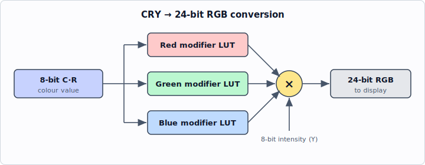

<!-- nav:top -->
[🏠 Atari Jaguar Developer Reference](../index.md) ▸ Tom — Graphics & Video ▸ **CRY Colour & Colour Mapping**
<!-- /nav:top -->

# CRY Colour & Colour Mapping

How the Jaguar represents colour: true-colour modes, the 16-bit RGB scheme, and the CRY (Cyan-Red-Intensity) scheme that gives cheap Gouraud shading from 16-bit pixels.

> **Source:** *Software Reference Manual — Tom & Jerry* (V10), pp. 30–33. © Atari Corp. 1995.

## Introduction

The Jaguar produces video output using **eight digital bits each for red, green and blue**. This gives each output 256 intensity levels, enough for smooth shading from one colour to another. This 24-bit scheme is known as **true-colour**.

### True-colour mode (24-bit)

The Jaguar can display true-colour pixels stored in memory as long words, with 8 bits unused — i.e. **32-bit pixels**. This is **true-colour mode**. The drawbacks:

- These 32-bit pixels are large and consume a lot of memory.
- They consume a lot of memory bandwidth to fetch from RAM for display.

True-colour mode is therefore unattractive for general use — most images do not need its colour range, and it has detrimental effects on performance. It is treated as a special case: when it is used, only true-colour images may be displayed.

### Normal operation (16-bit)

In normal operation the display system is based on **sixteen-bit pixels**. Images in memory may be stored either as 16-bit pixels, or as **1, 2, 4 or 8-bit logical colours**. Logical colours are used as indices into a **Palette / Colour-Look-Up-Table (CLUT)**, which holds their corresponding 16-bit physical colours.

A 16-bit pixel may be stored as **RGB 5:6:5** (six bits of green, five bits each of red and blue) — but this no longer allows smooth shading. The alternative is the **CRY scheme** (Cyan, Red and Intensity), which still allows smooth intensity shading.

| Mode | Pixel size | Layout | Smooth shading |
|------|-----------|--------|----------------|
| True-colour | 32-bit (8 unused) | 8 R : 8 G : 8 B | Yes |
| 16-bit RGB | 16-bit | 5 R : 6 G : 5 B | No |
| 16-bit CRY | 16-bit | see below | Yes (intensity) |
| Logical (CLUT) | 1 / 2 / 4 / 8-bit | index into CLUT → 16-bit physical colour | depends on CLUT contents |

## The CRY Colour Scheme

### Gouraud Shading Requirements

CRY was derived principally to meet the requirements of **Gouraud shading** — a technique that models the appearance of a lit curved surface from a set of polygons. If the intensity from a light source is calculated per polygon and the whole polygon painted in that colour, the individual polygons making up the surface are clearly visible.

Gouraud shading avoids this by calculating the intensity **at each vertex**, then **linearly interpolating along each polygon edge** and hence along each scan line of the display. If only white light sources are concerned, the only variation is **luminous intensity, not colour**. It is therefore attractive to have a colour scheme containing an **intensity vector**, so the Gouraud calculation need only be performed for one value rather than the three values a true-colour scheme would require.

There is general agreement that **eight bits is enough** to give smooth intensity shading (and it is a round number), so a scheme was needed that expressed the colour in the remaining eight bits.

### Colour Space

The colour space is modelled as an **RGB cube**:

- The lowest vertex represents **black**; the highest represents **white**.
- The three edges running out from black are the three orthogonal vectors **red, green and blue**. Their sum can describe any point in the cube.
- The three lower vertices represent fully saturated **red, green and blue**; the three higher ones represent **yellow, cyan and magenta**.

This model is only one of many ways of considering what the human brain "sees", but it has the advantage of modelling the display system used by colour monitors and of being mathematically simple.

### Physical Requirements

The **intensity vector** is the component of the sum of the red, green and blue vectors that lies along the diagonal of the RGB cube from black to white. This is not the "true" intensity (a weighted sum of R, G and B), but it bears a linear relationship to it when the colour is not changed.

The colour value must be encoded in the **remaining eight bits** of the pixel, subject to these requirements:

1. All 256 values should represent valid, and different, colours.
2. The colours should be well spaced out across the colour space.
3. Colours should be able to be mixed by linearly averaging their colour values.
4. An intensity value of zero must be black.

Because the colour space without intensity is two-dimensional, two vectors are required to represent a point in it. An **r, θ (polar) scheme was discarded** because it would not meet requirement 2, so a scheme based on **two x, y vectors** was chosen.

To meet requirement 1 the two vectors must describe a point on a **square** area. As no existing colour space model is square when viewed along the intensity axis, a new one was needed. The approach chosen, after considerable experimentation, was to take the **view along the intensity axis of the RGB cube — a hexagon — and distort it into a square**. This does not quite meet requirement 3, but is close to it.

### CRY Colour Scheme

The chosen scheme defines **256 points on the upper surface of the RGB cube**.

The hexagon (the view looking down onto the RGB cube) is distorted into a square whose **X and Y coordinates are four-bit values**, defining **256 colour levels**. Green was chosen as the primary colour lying in the middle of one face — selected after observing the three possible mappings, and matching the expected result because the human eye is **least able to distinguish shades of green**.

In each of the three areas defined on the hexagon/square, one of red, green or blue is at full intensity and the others vary. At the centre (white) all three are at full intensity. The intensity scale for any given colour lies along the line between black and the point on the top surface of the cube defined in the colour table.

Colours may be **averaged** by taking the average of their eight-bit intensity value and of each of the four-bit X and Y colour components. This will not produce exactly the same colour as the midway point between them in the RGB cube, but will be close to it.

#### 16-bit CRY pixel bit allocation

| Field | Bits | Width | Description |
|-------|------|-------|-------------|
| Intensity | 15–8 | 8 | Luminous intensity (intensity 0 = black) |
| Colour X (Cyan) | 7–4 | 4 | X coordinate of the distorted-hexagon square |
| Colour Y (Red) | 3–0 | 4 | Y coordinate of the distorted-hexagon square |

> Note: the manual specifies an 8-bit intensity value plus two 4-bit X/Y colour components (8 + 4 + 4 = 16 bits). The exact bit ordering of the X/Y fields within the low byte is not stated explicitly in this section; the table above reflects the C-R-Y (Cyan / Red / Intensity) naming convention.

#### Pros and cons

**Advantages**

- Smooth intensity shading from 16-bit pixels.
- Better matched to the capabilities of the human eye than 5:6:5-bit RGB schemes.
- Suitable for efficient Gouraud shading.

**Disadvantages**

- Steps are visible in smooth changes of saturation or hue.
- Translation from RGB to CRY is not straightforward.
- Non-standard.

### RGB to CRY conversion

The best technique:

1. Calculate the **intensity value**, which is the **largest of red, green and blue**.
2. From this, calculate the ideal ROM entry for that colour by **scaling the RGB values by `255 / intensity`**.
3. Match this to the actual ROM tables to find the **nearest match**.

A quick way of doing this is by a look-up table. It is not necessary for this to have 2²⁴ entries: taking the **top five bits of each of red, green and blue** (rounding where appropriate) and using a **32768-element (2¹⁵) look-up table** is adequate.

## Physical Implementation

The eight-bit colour value indexes a **look-up table of modifier values** for each of Red, Green and Blue. Each modifier is **multiplied by the intensity value** to give the output drive level for the display (24-bit RGB output).

The look-up tables below are each a 16 × 16 grid of modifier values, as printed in the manual. Rows are listed top to bottom as they appear in the source; each row contains 16 entries.

### Red look-up table

| Row | Values |
|-----|--------|
| 1 | 0, 0, 0, 0, 0, 0, 0, 0, 0, 0, 0, 0, 0, 0, 0, 0 |
| 2 | 34, 34, 34, 34, 34, 34, 34, 34, 34, 34, 34, 34, 34, 34, 19, 0 |
| 3 | 68, 68, 68, 68, 68, 68, 68, 68, 68, 68, 68, 68, 64, 43, 21, 0 |
| 4 | 102, 102, 102, 102, 102, 102, 102, 102, 102, 102, 102, 95, 71, 47, 23, 0 |
| 5 | 135, 135, 135, 135, 135, 135, 135, 135, 135, 135, 130, 104, 78, 52, 26, 0 |
| 6 | 169, 169, 169, 169, 169, 169, 169, 169, 169, 170, 141, 113, 85, 56, 28, 0 |
| 7 | 203, 203, 203, 203, 203, 203, 203, 203, 203, 183, 153, 122, 91, 61, 30, 0 |
| 8 | 237, 237, 237, 237, 237, 237, 237, 237, 230, 197, 164, 131, 98, 65, 32, 0 |
| 9 | 255, 255, 255, 255, 255, 255, 255, 255, 247, 214, 181, 148, 115, 82, 49, 17 |
| 10 | 255, 255, 255, 255, 255, 255, 255, 255, 255, 235, 204, 173, 143, 112, 81, 51 |
| 11 | 255, 255, 255, 255, 255, 255, 255, 255, 255, 255, 227, 198, 170, 141, 113, 85 |
| 12 | 255, 255, 255, 255, 255, 255, 255, 255, 255, 255, 249, 223, 197, 171, 145, 119 |
| 13 | 255, 255, 255, 255, 255, 255, 255, 255, 255, 255, 255, 248, 224, 200, 177, 153 |
| 14 | 255, 255, 255, 255, 255, 255, 255, 255, 255, 255, 255, 255, 252, 230, 208, 187 |
| 15 | 255, 255, 255, 255, 255, 255, 255, 255, 255, 255, 255, 255, 255, 255, 240, 221 |
| 16 | 255, 255, 255, 255, 255, 255, 255, 255, 255, 255, 255, 255, 255, 255, 255, 255 |

### Green look-up table

| Row | Values |
|-----|--------|
| 1 | 0, 17, 34, 51, 68, 85, 102, 119, 136, 153, 170, 187, 204, 221, 238, 255 |
| 2 | 0, 19, 38, 57, 77, 96, 115, 134, 154, 173, 192, 211, 231, 255, 255, 255 |
| 3 | 0, 21, 43, 64, 86, 107, 129, 150, 172, 193, 215, 236, 255, 255, 255, 255 |
| 4 | 0, 23, 47, 71, 95, 119, 142, 166, 190, 214, 238, 255, 255, 255, 255, 255 |
| 5 | 0, 26, 52, 78, 104, 130, 156, 182, 208, 234, 255, 255, 255, 255, 255, 255 |
| 6 | 0, 28, 56, 85, 113, 141, 170, 198, 226, 255, 255, 255, 255, 255, 255, 255 |
| 7 | 0, 30, 61, 91, 122, 153, 183, 214, 244, 255, 255, 255, 255, 255, 255, 255 |
| 8 | 0, 32, 65, 98, 131, 164, 197, 230, 255, 255, 255, 255, 255, 255, 255, 255 |
| 9 | 0, 32, 65, 98, 131, 164, 197, 230, 255, 255, 255, 255, 255, 255, 255, 255 |
| 10 | 0, 30, 61, 91, 122, 153, 183, 214, 244, 255, 255, 255, 255, 255, 255, 255 |
| 11 | 0, 28, 56, 85, 113, 141, 170, 198, 226, 255, 255, 255, 255, 255, 255, 255 |
| 12 | 0, 26, 52, 78, 104, 130, 156, 182, 208, 234, 255, 255, 255, 255, 255, 255 |
| 13 | 0, 23, 47, 71, 95, 119, 142, 166, 190, 214, 238, 255, 255, 255, 255, 255 |
| 14 | 0, 21, 43, 64, 86, 107, 129, 150, 172, 193, 215, 236, 255, 255, 255, 255 |
| 15 | 0, 19, 38, 57, 77, 96, 115, 134, 154, 173, 192, 211, 231, 255, 255, 255 |
| 16 | 0, 17, 34, 51, 68, 85, 102, 119, 136, 153, 170, 187, 204, 221, 238, 255 |

### Blue look-up table

| Row | Values |
|-----|--------|
| 1 | 255, 255, 255, 255, 255, 255, 255, 255, 255, 255, 255, 255, 255, 255, 255, 255 |
| 2 | 255, 255, 255, 255, 255, 255, 255, 255, 255, 255, 255, 255, 255, 255, 240, 221 |
| 3 | 255, 255, 255, 255, 255, 255, 255, 255, 255, 255, 255, 255, 252, 230, 208, 187 |
| 4 | 255, 255, 255, 255, 255, 255, 255, 255, 255, 255, 255, 248, 224, 200, 177, 153 |
| 5 | 255, 255, 255, 255, 255, 255, 255, 255, 255, 255, 249, 223, 197, 171, 145, 119 |
| 6 | 255, 255, 255, 255, 255, 255, 255, 255, 255, 255, 227, 198, 170, 141, 113, 85 |
| 7 | 255, 255, 255, 255, 255, 255, 255, 235, 204, 173, 143, 112, 81, 51 ... |
| 8 | 255, 255, 255, 255, 255, 255, 247, 214, 181, 148, 115, 82, 49, 17 |
| 9 | 237, 237, 237, 237, 237, 237, 237, 237, 230, 197, 164, 131, 98, 65, 32, 0 |
| 10 | 203, 203, 203, 203, 203, 203, 203, 203, 203, 183, 153, 122, 91, 61, 30, 0 |
| 11 | 169, 169, 169, 169, 169, 169, 169, 169, 169, 170, 141, 113, 85, 56, 28, 0 |
| 12 | 135, 135, 135, 135, 135, 135, 135, 135, 135, 135, 130, 104, 78, 52, 26, 0 |
| 13 | 102, 102, 102, 102, 102, 102, 102, 102, 102, 102, 102, 95, 71, 47, 23, 0 |
| 14 | 68, 68, 68, 68, 68, 68, 68, 68, 68, 68, 68, 68, 64, 43, 21, 0 |
| 15 | 34, 34, 34, 34, 34, 34, 34, 34, 34, 34, 34, 34, 34, 34, 19, 0 |
| 16 | 0, 0, 0, 0, 0, 0, 0, 0, 0, 0, 0, 0, 0, 0, 0, 0 |

> **Note on the source layout:** In the original manual these tables are printed as columns of values with inconsistent grouping (some entries run together on a line, e.g. "102 102 102"), so the exact 16-per-row boundaries for a few rows are reconstructed from the regular structure of the surrounding rows. The Blue table rows 7 and 8 are printed in the source with fewer than 16 explicit entries before a line break, so their full 16-value extent at the start of each row is **(illegible)** in the source as transcribed; the trailing values shown are faithful to the text.

## See also

- [Object Processor](object-processor.md)
- [Blitter](blitter.md) (Gouraud shading)
- [Memory Map / Register List](../architecture/memory-map.md) (CLUT)
- [System Architecture Overview](../architecture/overview.md)

<!-- nav:bottom -->
---

◀ **Prev:** [Blitter (Tom)](blitter.md) &nbsp;·&nbsp; 🏠 **[Home](../index.md)** &nbsp;·&nbsp; **Next:** [Digital Sound Processor (DSP)](../jerry/dsp.md) ▶

**Jump to:** [Architecture](../architecture/overview.md) · [Memory Map](../architecture/memory-map.md) · [Registers](../reference/register-list.md) · [Instructions](../reference/risc-instruction-set.md) · [Glossary](../reference/glossary.md) · [CD-ROM](../cdrom/overview.md)
<!-- /nav:bottom -->
