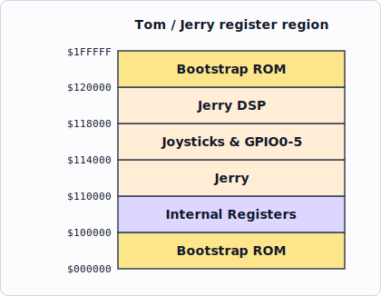
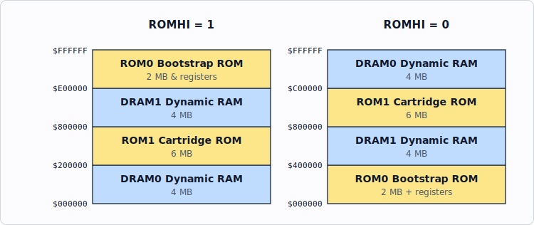
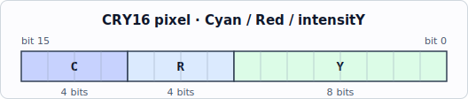
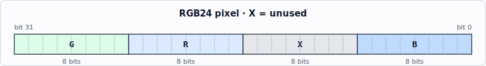
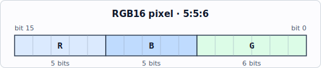

<!-- nav:top -->
[🏠 Atari Jaguar Developer Reference](../index.md) ▸ Tom — Graphics & Video ▸ **Object Processor (Tom)**
<!-- /nav:top -->

# Object Processor (Tom)

Tom's Object Processor combines frame-store and sprite-based video architectures, building display lines by executing a list of objects that write pixels into line buffers.

> **Source:** *Software Reference Manual — Tom & Jerry* (V10), pp. 8–29. © Atari Corp. 1995.

## Overview

The Jaguar video section was designed to drive a PAL/NTSC TV, but its flexible design lets it span a range of display standards from VGA through to WorkStation.

Two color resolutions are supported: 24-bit and 16-bit. The 24-bit mode is useful for true-color applications. The 16-bit mode is designed for animation — it consumes less memory, fits better into 64-bit memory, and in the case of CRY (Cyan, Red and intensitY) is simpler to shade and is almost indistinguishable from 24-bit mode.

The Jaguar decouples the pixel frequency from the system clock by using a **line buffer**, so the system clock need not be related to the color carrier frequency and may be unaffected by gen-locking. There are actually **two line buffers**: one is displayed while the other is prepared by the Object Processor. Each line buffer is a 360 x 32-bit RAM holding physical pixels (16- or 24-bit). The line buffers may be swapped over at the start and in the middle of display lines.

In CRY, pixels at the output of the line buffer are converted to 24-bit RGB pixels using a combination of look-up tables and small multipliers. The video timing is completely programmable in units of the video clock.

The Object Processor is simple yet sophisticated. It has scaled and unscaled bit-map objects, branch objects to control its flow, and interrupt objects. It can interrupt the Graphics Processor to perform more complex operations on its behalf (perspective, rotation, branches, palette loads, etc.).

The Object Processor can write into the line buffer at up to **two pixels per clock cycle**. Source data can be 1, 2, 4, 8, 16 or 24 bits per pixel. Except for 24 bits, objects of different color resolutions can be mixed. Low-resolution objects (1–8 bits) use a palette to obtain a 16-bit physical color.

A key feature is that the Object Processor can **modify the existing contents of the line buffer** with another image — useful for shadows, mist or smoke, colored glass, or the effect of a room lit by a flash lamp. It can also ignore non-pixel data stored alongside pixel data (e.g. a Z buffer placed next to the pixels), which reduces the frequency of DRAM RAS pre-charges.

## Object Processor Performance

Each object is described by an **object header**: two phrases for an unscaled object, three phrases for a scaled object. When an image has been processed the modified header is written back to memory.

The Object Processor fetches one phrase (64 bits) of video data at a time. This phrase is expanded into pixels (and written into the line buffer) while the next phrase is fetched. The image data consists of a whole number of phrases; it may need to be padded with transparent pixels (color zero in 1, 2, 4, 8 & 16-bit modes).

The Object Processor writes into the line buffer at one write per system clock tick:

- 24-bits-per-pixel mode and scaled objects: **one pixel per cycle**.
- Unscaled objects with 16 or fewer bits-per-pixel: **two pixels per cycle**.

Most objects are therefore expanded at twice the processor clock rate. If the read-modify-write flag is set in the object header, object data is added to the previous line-buffer contents and the data rate into the line buffer is halved.

This peak rate may be reduced if memory bandwidth is insufficient. With 64-bit-wide DRAM installed, these data rates are sustained for all modes. In 64-bit-wide DRAM, successive locations cycle in two clock ticks (page-mode cycles). When DRAM row addresses must change there is an overhead of between three and seven clock cycles (depending on DRAM speed). RAS cycles occur infrequently during object data fetches but typically occur on the first data read after reading the object header (header and image data are not normally near each other), after refresh cycles, or if a higher-priority bus master steals cycles in an area with a different row address. Refresh cycles are normally postponed until object processing has completed.

### Bus-priority rules (critical)

- The GPU and Blitter **may not be used in high bus priority while the Object Processor is running.** The **DMAEN** bit of [`G_FLAGS`](gpu.md#g_flags--gpu-flags-register-f02100-rw) should be `0`, and the **BUSHI** bit of [`B_CMD`](blitter.md#b_cmd--command-register-f02238-wo) should be `0`.
- **No bus master may operate at a higher priority than the Object Processor.** If something else gets the bus between the second and third phrases of an object header, the line buffer address can be corrupted, causing horizontal black stripes and possibly other artifacts in the display.

Full bus-master priority list (Microprocessor Interface), highest to lowest:

| Rank | Bus master |
|------|------------|
| 1 (highest) | Higher-priority daisy-chained bus master |
| 2 | Refresh |
| 3 | DSP at DMA priority |
| 4 | GPU at DMA priority |
| 5 | Blitter at high priority |
| 6 | Object Processor |
| 7 | DSP at normal priority |
| 8 | CPU under interrupt |
| 9 | GPU at normal priority |
| 10 | Blitter at normal priority |
| 11 (lowest) | CPU |

The CPU normally has the lowest bus priority, but under interrupt its priority is increased.

## Memory Controller

The memory controller hides memory width, speed and type from the rest of the system. Memory is grouped into banks that may differ in width, speed and type (both ROM banks share the same width and speed). Each bank is enabled by a chip select; for DRAM there are two chip selects, RAS & CAS. Memory widths may be 8, 16, 32 or 64 bits, but the controller makes everything look 64 bits wide.

There are eight write strobes — one per 8 bits — and three output enables corresponding to `d[0-15]`, `d[16-31]` and `d[32-63]`. Three memory types are supported: **DRAM, SRAM and ROM**.

- **ROM/EPROM** is used for bootstrap and cartridges. ROM speed is programmable; the controller views ROM as 64 bits wide. Pull-up / pull-down resistors determine ROM width during reset.
- **DRAM** is the principal memory type. In fast page mode it cycles at two ticks per transfer. Row access time is programmable; column access time is not (adjustable only by changing the system clock). The controller decides cycle-by-cycle whether the next cycle can be fast page mode. Page size is **2 Kbytes**; data should be organized to minimize page changes.

There are four memory banks: two of ROM and two of DRAM.

## Microprocessor Interface

The Jaguar works with any 16- or 32-bit microprocessor with up to 24 address lines. The interface is based on the 68000; most microprocessors attach via a PAL that synthesizes the differing control signals. All peripherals are memory-mapped — there is no separate I/O space. The microprocessor width is determined during reset by a pull-up / pull-down resistor. Boot-vector variation is accommodated by making the bootstrap ROM appear everywhere until the microprocessor configures memory. The interface is generally asynchronous, so microprocessor and co-processor clock speeds may be independent. Jerry uses the same microprocessor interface.

## Memory Map

After reset, a 2 Mbyte window corresponding to ROM0 is repeated throughout the 16 Mbyte address space until the microprocessor configures memory by writing `MEMCON1`. (This lets the system boot whether the microprocessor is a 680x0, an 80x86, or a Transputer.) After configuration the window corresponds to the ROM0 area.

Reset window (repeated until `MEMCON1` is written):

Once memory is configured, one of two maps is selected by the `ROMHI` bit of the memory configuration register:

> Note: the source's two memory-map columns are page-laid-out and partially overlapping; the addresses above are transcribed exactly as printed, but the precise vertical alignment of bands in the original is ambiguous in the page text.

ROM0 is the bootstrap ROM; internal (ASIC) memory and peripherals occupy 128 Kbytes of this space. ROM1 is the cartridge ROM. DRAM0 and DRAM1 are the two banks of DRAM. A 68000 system naturally operates with RAM at 0, so **`ROMHI = 1` is assumed throughout** this document. With `ROMHI = 0`, the first digit of all internal addresses is `1` rather than `F`.

## Internal Memory Map

Internal memory is mostly 16 bits wide to allow operation with 16-bit microprocessors. 32-bit write cycles are allowed to some areas — notably the line buffer (to accelerate Blitter writes) and graphics processor memory (to accelerate program and data loads).

### MEMCON1 — Memory Configuration Register One — `F00000` — RW

*Do NOT Modify: For information only.*

| Bits | Name | Description |
|------|------|-------------|
| 0 | ROMHI | When set, the two ROM decodes address the top 8 Mb within the 16 Mb window; when clear, the bottom 8 Mb. This document assumes `ROMHI` set. |
| 1-2 | ROMWIDTH | Width of ROM: 0 = 8 bits, 1 = 16 bits, 2 = 32 bits, 3 = 64 bits. |
| 3-4 | ROMSPEED | ROM cycle time: 0 = 10 clock cycles, 1 = 8, 2 = 6, 3 = 5. |
| 5-6 | DRAMSPEED | DRAM speed (page-mode cycle is always two clocks; these bits set RAS-related timing — see table below). |
| 7 | FASTROM | Sets ROM cycle time to two clock cycles. Test purposes only. |
| 8-10 | Unused | Set to zero. |
| 11-12 | IOSPEED | Speed of external peripherals (overall cycle time; strobes active for two cycles less): 0 = 18 clock cycles, 1 = 10, 2 = 4, 3 = 6. |
| 13 | Unused | Set to zero. |
| 14 | CPU32 | Indicates the microprocessor is 32 bits. |
| 15 | Unused | Set to zero. |

DRAMSPEED (bits 5,6) timing, in clock cycles:

| Bits 5,6 | Precharge | RAS to CAS | Refresh |
|----------|-----------|------------|---------|
| 0 | 4 | 3 | 5 |
| 1 | 4 | 3 | 4 |
| 2 | 3 | 2 | 4 |
| 3 | 2 | 1 | 3 |

All ROMSPEED bits are zero on reset. `ROMHI`, `ROMWIDTH` and `CPU32` are determined by external pull-up / pull-down resistors; all other bits are undefined. ROM0 repeats every 2 Mbytes until this register is written.

### MEMCON2 — Memory Configuration Register Two — `F00002` — RW

*Do NOT Modify: For information only.*

| Bits | Name | Description |
|------|------|-------------|
| 0-1 | COLS0 | Number of columns in DRAM0: 0 = 256, 1 = 512, 2 = 1024, 3 = 2048. |
| 2-3 | DWIDTH0 | Width of DRAM0: 0 = 8 bits, 1 = 16, 2 = 32, 3 = 64. |
| 4-5 | COLS1 | Number of columns in DRAM1: 0 = 256, 1 = 512, 2 = 1024, 3 = 2048. |
| 6-7 | DWIDTH1 | Width of DRAM1: 0 = 8 bits, 1 = 16, 2 = 32, 3 = 64. |
| 8-11 | REFRATE | Refresh rate. DRAM rows are refreshed at `CLK / (64 x (REFRATE+1))`. Many DRAMs need 64 KHz. Refresh occurs at the end of object processing. If `REFRATE` is zero, refresh is disabled. |
| 12 | BIGEND | Use big-endian addressing (address of a byte within a phrase); supports Big-endian (Motorola) or Little-endian (Intel) processors. |
| 13 | HILO | Image data should be displayed from high-order bits to low-order. |

All the above bits are undefined on reset except `BIGEND`, which is set by external pull-up / pull-down resistors.

### Video timing & control registers

| Equate | Name | Address | Access | Notes |
|--------|------|---------|--------|-------|
| HC | Horizontal Count | `F00004` | RW | Ten-bit counter, counts to the horizontal period register twice per line; an 11th bit selects the display half. ASIC test purposes only. |
| VC | Vertical Count | `F00006` | RW | Eleven-bit counter, counts to the vertical period register once per field; a 12th bit selects odd/even field. Incremented every half line. Readable for beam-synchronous operations; written only for ASIC test. |
| LPH | Horizontal Light-Pen | `F00008` | RO | Eleven-bit horizontal light-pen position in pixels. |
| LPV | Vertical Light-Pen | `F0000A` | RO | Low eleven bits give vertical light-pen position in half lines. |
| OB[0-3] | Object Code | `F00010-16` | RO | Let the GPU read the current object so a GPU object can pass parameters to the GPU interrupt service routine. |
| OLP | Object List Pointer | `F00020` | WO | 32-bit pointer to the start of the object list (see below). |
| OBF | Object Processor Flag | `F00026` | WO | See below. |
| VMODE | Video Mode | `F00028` | WO | See below. |
| BORD1 | Border Color (Red & Green) | `F0002A` | WO | Physical border color, eight bits per primary. Red is the LSB of BORD1. |
| BORD2 | Border Color (Blue) | `F0002C` | WO | Border color, Blue. |
| HP | Horizontal Period | `F0002E` | WO | *Info only.* Ten-bit; period of half a display line in video clock cycles (one tick longer than the value). |
| HBB | Horizontal Blanking Begin | `F00030` | WO | *Info only.* Eleven-bit; start of horizontal blanking. MSB usually set (blanking starts in 2nd half). |
| HBE | Horizontal Blanking End | `F00032` | WO | *Info only.* Eleven-bit; end of horizontal blanking. MSB usually clear. |
| HS | Horizontal Sync | `F00034` | WO | *Info only.* Eleven-bit; width of horizontal sync / equalization pulses. |
| HVS | Horizontal Vertical Sync | `F00036` | WO | *Info only.* Ten-bit; end position of vertical sync pulses. |
| HDB1 | Horizontal Display Begin 1 | `F00038` | WO | Eleven-bit; where the OP starts on the line (see below). |
| HDB2 | Horizontal Display Begin 2 | `F0003A` | WO | Eleven-bit; second OP start (mid-line) for twice-per-line operation. |
| HDE | Horizontal Display End | `F0003C` | WO | Eleven-bit; when the display ends. Border color or black (if HBB < HDE) shown after. |
| VP | Vertical Period | `F0003E` | WO | *Info only.* Eleven-bit; half lines per field (one more than the value). Odd count = interlaced. |
| VBB | Vertical Blanking Begin | `F00040` | WO | *Info only.* Eleven-bit; half line vertical blanking begins. |
| VBE | Vertical Blanking End | `F00042` | WO | *Info only.* Eleven-bit; half line vertical blanking ends. |
| VS | Vertical Sync | `F00044` | WO | *Info only.* Eleven-bit; half line vertical sync begins. |
| VDB | Vertical Display Begin | `F00046` | WO | Eleven-bit; half line on which object processing begins. |
| VDE | Vertical Display End | `F00048` | WO | Eleven-bit; half line object processing ends. **Due to a Jaguar Console bug, set this to `$FFFF`** to process every line. |
| VEB | Vertical Equalization Begin | `F0004A` | WO | *Info only.* Eleven-bit; half line equalization pulses start. |
| VEE | Vertical Equalization End | `F0004C` | WO | *Info only.* Eleven-bit; half line equalization pulses end. |
| VI | Vertical Interrupt | `F0004E` | WO | Eleven-bit; half line on which the VI interrupt is generated. Must be odd if non-interlaced. |
| PIT[0-1] | Programmable Timer Interrupt | `F00050-52` | WO | Two 16-bit registers; control frequency of interrupts to both CPU and GPU (operate as a pair). |
| HEQ | Horizontal Equalization End | `F00054` | WO | *Info only.* Ten-bit; end position of equalization pulses. |
| BG | Background Color | `F00058` | WO | CRY color to which the line buffer is cleared. |
| INT1 | CPU Interrupt Control Register | `F000E0` | RW | See below. |
| INT2 | CPU Interrupt Resume Register | `F000E2` | WO | See below. |
| CLUT | Color Look-Up Table | `F00400-7FE` | RW | See below. |
| LBUF | Line Buffer | `F00800-0D9E`, `F01000-159E`, `F01800-1D9E` | RW | See below. |

#### OLP — Object List Pointer (`F00020`, WO)

32-bit register pointing to the start of the object list. All objects must be on a phrase boundary, so the bottom three bits are always zero. When one object links to another, bits 3–21 of this address are replaced by the LINK data in the object. The value stored should be **word-swapped**. Because the OP could interrupt the 68000 mid-write to this register, the **68000 should never change OLP — use the GPU instead.**

#### OBF — Object Processor Flag (`F00026`, WO)

Bit 0 can be tested by the Object Processor branch instruction: if set, the branch is taken; if clear, execution continues with the next object. This is a mechanism for the GPU to control OP program flow. A write (of anything) to this register **restarts the Object Processor after a GPU interrupt object.**

#### VMODE — Video Mode (`F00028`, WO)

| Bits | Name | Description |
|------|------|-------------|
| 0 | VIDEN | Enables the time-base generator. Never set to zero in a Jaguar Console. |
| 1-2 | MODE | How line-buffer contents are translated into physical pixels (see below). |
| 3 | GENLOCK | Not supported in the Jaguar console — always write zero. |
| 4 | INCEN | Enables encrustation: the LSB of the 16-bit data switches between local and external video sources via an external multiplexer (per-pixel). |
| 5 | BINC | Selects the local border color if encrustation is enabled. |
| 6 | CSYNC | Enables composite sync on the vertical sync output. |
| 7 | BGEN | Clears the line buffer to the background-register color after displaying it. Effective only in CRY and RGB16 modes. |
| 8 | VARMOD | Enables variable color resolution mode. The LSB of each line-buffer word selects the coding of the other 15 bits: clear = CRY pixel; set = bits [1-5] Green, [6-10] Blue, [11-15] Red. Allows an RGB window against a CRY background. |
| 9-11 | PWIDTH1-8 | Pixel width in video clock cycles; width is one more than the field value. The video time base is programmed in video-clock cycles, not the pixel clock from this divider. Display width should be an integer multiple of the pixel width. |
| 12-15 | Unused | Write zeroes. |

MODE values (bits 1-2):

- **CRY16 (0)** — 16-bit CRY. Each 32-bit line-buffer entry is two 16-bit CRY pixels on successive clock cycles, each converted to 8 bits each of R, G, B via look-up tables and multipliers. The LSB is normally the LSB of intensity; if `VARMOD` is also set, this bit is cleared to mark a CRY16 pixel and only the top seven bits set intensity.

- **RGB24 (1)** — 24-bit RGB. Each 32-bit entry is one physical pixel: 8 bits Red, 8 Green, 8 Blue, 8 unused.

- **DIRECT16 (2)** — 16-bit direct. Each 32-bit entry is two 16-bit words output directly onto Red and Green outputs on alternate phases of the video clock, for dot clocks above the video clock; further multiplexing and color look-up happen off-chip. Blanking and video-active are output on the two LSBs of Blue.

- **RGB16 (3)** — 16-bit RGB. Each 32-bit entry is two 16-bit RGB pixels. The LSB is normally the LSB of Green; if `VARMOD` is set, this bit is set to mark an RGB16 pixel and only the top five bits set Green.

#### INT1 — CPU Interrupt Control Register (`F000E0`, RW)

Enables, identifies and acknowledges interrupts from five CPU interrupt sources.

| Equate | Bit | Interrupt | Description |
|--------|-----|-----------|-------------|
| C_VIDENA | 0 | Video | Generated by the video time-base on the line selected by [`VI`](../architecture/memory-map.md#system-set-up--video-registers-tom). |
| C_GPUENA | 1 | GPU | Generated by the GPU writing to an internal register. |
| C_OPENA | 2 | Object | Generated by stop objects. |
| C_PITENA | 3 | Timer | Generated by the PIT. |
| C_JERENA | 4 | Jerry | Generated by an input to Tom for Jerry's use (Jerry tells Tom to interrupt the CPU). Active-high, edge-triggered — first interrupt on the first rising edge after enabling. |
| C_VIDCLR | 8 | Video | When set, clears pending video time-base interrupts. |
| C_GPUCLR | 9 | GPU | When set, clears pending GPU interrupts. |
| C_OPCLR | 10 | Object | When set, clears pending OP stop-object interrupts. |
| C_PITCLR | 11 | Timer | When set, clears pending PIT interrupts. |
| C_JERCLR | 12 | Jerry | When set, clears pending Jerry interrupts. |

When written, bits 0–4 enable individual sources and bits 8–12 clear pending interrupts. When read, bits 0–4 indicate which interrupts are pending. The INT2 register must always be written at the end of a CPU interrupt service routine.

#### INT2 — CPU Interrupt Resume Register (`F000E2`, WO)

When an interrupt is applied to the CPU, the bus priorities of the GPU and Blitter are reduced so the CPU can service real-time interrupts promptly. Writing any value here restores them — do this at the end of every interrupt service routine. After the write, the Blitter and GPU may restart, and no further CPU instructions execute until the next interrupt occurs or the GPU/Blitter operation completes.

#### CLUT — Color Look-Up Table (`F00400-7FE`, RW)

Translates an 8-bit color index (from object data of 1, 2, 4 or 8 bits) into a 16-bit physical color. For throughput there are **two tables**, allowing two pixels at a time into the line buffer. Each table has 256 16-bit entries. `F00400-5FE` reads from **table A**; `F00600-7FE` reads from **table B**. Writing to either range writes both tables. Writes to this region may be unreliable when an object with the 'Release' bit is part of the current object list.

#### LBUF — Line Buffer (`F00800-0D9E`, `F01000-159E`, `F01800-1D9E`, RW)

Two line buffers, each a 360 x 32-bit RAM. Each 32-bit long-word can be read/written as two 16-bit words. In 16-bit CRY mode each word is a CRY pixel (LSB = intensity); the lowest-address word is the left-most pixel. In 24-bit RGB mode each long-word is a pixel: LSB of the low word = Red, MSB of the low word = Green, LSB of the high word = Blue; the fourth byte is unused.

- First range: line buffer A
- Second range: line buffer B
- Third range: the line buffer currently selected for writing (for the GPU to assist the OP). The first two ranges are for test purposes.

Adding `8000h` to the above ranges enables 32-bit writes to the line buffer (mainly to accelerate the Blitter).

## Peripheral Memory Map

Jerry and external peripherals occupy the 64K above the internal memory. All peripheral memory is 16 bits wide, although many devices will have 8-bit busses.

## Object Definitions

There are five basic object types. (TYPE field, bits 0-2: 0 = bit-mapped, 1 = scaled bit-mapped, 2 = GPU, 3 = branch, 4 = stop.)

### BITOBJ — Bit Mapped Object (type 0)

Displays an unscaled bit-mapped object. Must be on a **16-byte boundary** in 64-bit RAM.

**First Phrase**

| Bits | Field | Description |
|------|-------|-------------|
| 0-2 | TYPE | Bit-mapped object is type zero. |
| 3-13 | YPOS | Vertical counter value (in half lines) for the first (top) line. The vertical counter is latched when the OP starts, so it is constant across the line. Interlaced: even for even lines, odd for odd lines; non-interlaced: always even. Object active while `vertical counter >= YPOS` and `HEIGHT > 0`. |
| 14-23 | HEIGHT | Number of data lines in the object. Reduced by one per line (non-interlaced) or two (interlaced); becomes zero rather than negative. New value written back. For scaled bitmap objects, HEIGHT should be the bitmap height − 1. |
| 24-42 | LINK | Address of the next object. These nineteen bits replace bits 3–21 in OLP, so an object links within the same 4 Mbytes. |
| 43-63 | DATA | Where the pixel data is found (a phrase address). These twenty-one bits define bits 3–23 of the data address, positioning data anywhere in memory. After a line is displayed the new address is written back. |

**Second Phrase**

| Bits | Field | Description |
|------|-------|-------------|
| 0-11 | XPOS | X position of the first pixel plotted. 12-bit, range −2048 to +2047. Address 0 = left-most pixel in the line buffer. |
| 12-14 | DEPTH | Bits per pixel (see table below). |
| 15-17 | PITCH | How much embedded data must be skipped. `8 * PITCH` is added to the data address when a new phrase is fetched. PITCH = 1 for contiguous data; PITCH = 0 repeats the same phrase. |
| 18-27 | DWIDTH | Data width in phrases: next line of pixels at `DATA + (8 * DWIDTH)`. |
| 28-37 | IWIDTH | Image width in phrases (must be non-zero). May be used for clipping. |
| 38-44 | INDEX | For 1–4 bits/pixel images, the top 7 to 4 bits of the index provide the most significant bits of the palette address. |
| 45 | REFLECT | Draw the object right to left. |
| 46 | RMW | Add object to data in the line buffer (values are then signed offsets for intensity and the two color vectors). See caveat below. |
| 47 | TRANS | Make logical color zero transparent. |
| 48 | RELEASE | Forces the OP to release the bus between data fetches (see note below). |
| 49-54 | FIRSTPIX | First pixel to be displayed (for clipping). LSB is only significant for scaled objects (one pixel at a time); other bits define the first pair of pixels. In 1 bit/pixel all five bits are significant; in 2 bit/pixel only the top four. Writing zeroes displays the whole phrase. |
| 55-63 | Unused | Write zeroes. |

DEPTH (bits 12-14):

| Value | Bits per Pixel | Type | Video Modes Allowed In |
|-------|----------------|------|------------------------|
| 0 | 1 bit/pixel | CLUT | CRY16, RGB16 & DIRECT16 |
| 1 | 2 bits/pixel | CLUT | CRY16, RGB16 & DIRECT16 |
| 2 | 4 bits/pixel | CLUT | CRY16, RGB16 & DIRECT16 |
| 3 | 8 bits/pixel | CLUT | CRY16, RGB16 & DIRECT16 |
| 4 | 16 bits/pixel | Direct | CRY16, RGB16 & DIRECT16 |
| 5 | 32 bits/pixel | Direct | RGB24 |

**RMW caveat:** The last column of pixels of an RMW (Read-Modify-Write) object can be corrupted if it is followed by another bitmap object — on the right side, unless REFLECT is set (then the left side). Work-arounds: pad the data source so the last pixels are all transparent; ensure the next object does not appear on the same scan lines; or place an always-false branch object after the RMW object.

**RELEASE note:** Typically set for low color-resolution objects (1–8 bits/pixel), where there is time for another bus master to use the bus between data fetches. For high color-resolution objects the bus should be held (little time between fetches; other masters would likely cause DRAM page faults). The bit may be set in 16-bit scaled bitmap objects. External bus masters, the refresh mechanism, and the GPU DMA mechanism all have higher bus priority and are unaffected by this bit.

### SCBITOBJ — Scaled Bit Mapped Object (type 1)

Displays a scaled bit-mapped object. Must be on a **32-byte boundary** in 64-bit RAM. Scaled bitmaps will not display properly in 24-bit RGB mode. The first 128 bits are identical to BITOBJ except TYPE is one; an extra (third) phrase is appended:

| Bits | Field | Description |
|------|-------|-------------|
| 0-7 | HSCALE | Three-bit integer part + five-bit fractional part. Determines how many pixels are written into the line buffer per source pixel. May be as high as 7.1F (`%111.11111`), but a 24-bit scaled object is distorted at any HSCALE other than 1.0 (`%001.00000`). |
| 8-15 | VSCALE | Three-bit integer + five-bit fractional. Display lines drawn per source line. Equals HSCALE to keep aspect ratio. Setting VSCALE greater than 7.0 (`%111.00000`) will fail. |
| 16-23 | REMAINDER | Three-bit integer + five-bit fractional. Display lines left from the current source line. Decremented by one per display line; if negative, VSCALE is added until positive, and HEIGHT is decremented each time VSCALE is added. New REMAINDER written back. Initialize to the same value as VSCALE for a perfectly scaled first line. |
| 24-63 | Unused | Write zeroes. |

### GPUOBJ — Graphics Processor Object (type 2)

Interrupts the GPU, which may act on the OP's behalf. The OP resumes when the GPU writes to OBF.

| Bits | Field | Description |
|------|-------|-------------|
| 0-2 | TYPE | GPU object is type two. |
| 3-63 | DATA | For the GPU interrupt service routine. Memory-mapped in the object code registers OB[0-3], usable as data or as a pointer to additional parameters. |

Execution continues with the object in the next phrase. The GPU may set or clear the (memory-mapped) Object Processor flag to redirect the OP using the following object.

### BRANCHOBJ — Branch Object (type 3)

Directs object processing either to the LINK address or to the object in the following phrase.

| Bits | Field | Description |
|------|-------|-------------|
| 0-2 | TYPE | Branch object is type three. |
| 3-13 | YPOS | May be used to determine whether the LINK address is used. |
| 14-16 | CC | Condition selecting where to continue (see table below). |
| 17-23 | Unused | |
| 24-42 | LINK | Address of the next object if the branch is taken (as for the bit-mapped object). |
| 43-63 | Unused | |

CC values (bits 14-16):

| CC | Condition |
|----|-----------|
| 0 | Branch to LINK if `YPOS == VC` or `YPOS == 7FF` |
| 1 | Branch to LINK if `YPOS > VC` |
| 2 | Branch to LINK if `YPOS < VC` |
| 3 | Branch to LINK if the Object Processor flag is set |
| 4 | Branch to LINK if on the second half of the display line (`HC10 = 1`) |

### STOPOBJ — Stop Object (type 4)

Stops object processing and interrupts the host.

| Bits | Field | Description |
|------|-------|-------------|
| 0-2 | TYPE | Stop object is type four. |
| 3 | INT FLAG | When set, CPU stop-object interrupts are enabled. |
| 4-63 | DATA | For the CPU interrupt service routine. Memory-mapped, usable as data or as a pointer to additional parameters. |

## Description of the Object Processor / Pixel Path

> The original section is accompanied by three block diagrams (*Jaguar Chip Block Diagram*, *Object Processor Block Diagram*, *Object Data Path*) and a *Pixel Data Path* diagram. These are images in the source and are **(illegible)** in the page text; only the descriptive prose is transcribed below.

The **processor bus** is a 64-bit data, 24-bit address multi-master bus; the bus master can change cycle-by-cycle with no overhead. The external CPU controls this bus when it is bus master. The **IO bus** is a 16-bit data, 16-bit address bus for internal memory and registers. The bus interface allows transfers of any width (one to eight bytes) to any width of external memory and accommodates 16- and 32-bit microprocessors. It also generates a multiplexed address for DRAMs (a function of memory width and column count); the memory controller only performs RAS cycles when the row address changes.

The **line buffer** bridges two asynchronous parts of the chip: processors/memory on one side, video timing and pixel generators on the other. There are two line buffers — while one is written by the OP, the other is read by the pixel logic. Each is a small 360 x 32 RAM with independent write strobes for the high and low words. Each location holds one 24-bit pixel or two 16-bit pixels.

The OP reads object headers and image data and writes back modified headers. Write-back normally increases the data address by the data width; for scaled objects the data address increases by a multiple of the data width and the vertical remainder is modified. Object data contains physical colors (16/24 bits-per-pixel) or logical colors (1, 2, 4, 8 bits-per-pixel); logical colors are translated to physical via the CLUT.

### Object Data Path

The OP fetches data one phrase at a time until the image data for that header is exhausted or the line-buffer address (X coordinate) becomes invalid. Behavior depends on color resolution and whether the object is scaled:

- **24 bits-per-pixel:** each phrase holds two pixels (16 bits unused per phrase). The multiplexers select each in turn; one 24-bit pixel per clock cycle. CLUT bypassed.
- **16 bits-per-pixel:** each phrase holds four pixels. Two pixels selected at a time; two pixels into the line buffer per clock cycle. CLUT bypassed.
- **1, 2, 4, 8 bits-per-pixel:** each phrase holds 64, 32, 16, 8 pixels respectively. Two pixels selected at a time. In 1/2/4-bit modes the pixel is extended to eight bits using the top bits of the palette offset (an object-header field). The two 8-bit values address a pair of identical CLUTs, yielding two 16-bit physical pixels written into the line buffer every cycle.

If an object is scaled, the OP deals with one pixel at a time, not pairs. Scaling is achieved by incrementing the line-buffer address independently of the multiplexer counter (e.g. incrementing the address twice as often doubles the image width).

There are two line buffers, A & B: while A is written by the OP, B is read by the pixel logic; at the start of the next display line they swap (A displayed, B written), effectively via multiplexers on all signals attached to the line buffers.

This description is complicated by:

- If a pixel pair must be written to an odd location, they are swapped and one pixel delayed.
- The line-buffer address decrements if the object is reflected.
- The color written can instead be added to the previous value.
- One color may be transparent and is not written.
- The line buffers also appear as memory to the rest of the system.

### Pixel Data Path

This logic runs from the **video clock** (different from the previous logic). Operation depends on the video mode:

- **24 bits-per-pixel:** line buffer read at the video clock frequency; data latched and presented at the pins as red, green and blue.
- **CRY:** line buffer read at half the video clock frequency; each read yields two 16-bit CRY values, multiplexed into the CRY-to-RGB conversion during succeeding video clock cycles. The top eight bits specify color, the low bits specify intensity. The color value indexes three ROMs holding relative R, G, B amounts; their outputs are multiplied by brightness to get the final 8 bits each of R, G, B.
- **RGB16:** line buffer read at half the video clock frequency; each read yields two 16-bit RGB values. Bits 0-5 = six MSBs of green, bits 6-10 = five MSBs of blue, bits 11-15 = five MSBs of red; other bits zero.
- **Direct mode:** a fourth mode for very high pixel rates using external multiplexers and DACs. The line buffer is read at the video clock frequency and the 2:1 multiplexer is driven by the video clock directly. Its output connects directly to the red and green outputs, allowing 16-bit values at twice the maximum video clock frequency — video bandwidth up to four times the video clock. Values are re-synchronized, de-multiplexed and converted to analog off-chip. Blanking and border signals are output on the blue pins.

In all modes, additional logic sets the output to black during blanking and to the border color where appropriate. Further complications:

- In CRY and RGB16 modes the LSB can be sacrificed (treated as zero) to control an external video switch through the incrust output pin.
- In CRY and RGB16 modes a background color may be written into the line buffer after it has been read.
- In CRY and RGB16 modes the LSB may determine whether the mode is CRY or RGB16 — useful for dropping a decompressed RGB picture into a CRY picture without an RGB-to-CRY conversion.

## Refresh Mechanism

The average refresh frequency is defined by the `REFRATE` bits in `MEMCON2`. Refresh cycles are grouped together to lessen the impact on system performance, but cannot be performed in very large numbers or they would create "dead spots" with no processing, disrupting display or sound.

The Jaguar uses a counter to accumulate refresh cycles. When the counter reaches eight, **eight refresh cycles** are done and the counter is reset to zero. Refresh cycles are also invoked when the OP reaches the end of the object line: after the OP executes a STOP object, the Jaguar performs as many refresh cycles as needed to decrement the refresh counter to zero.

This guarantees the minimum refresh rate without interrupting the Object Processor and without creating dead spots of more than a few microseconds.

## See also

- [System Architecture Overview](../architecture/overview.md)
- [Memory Map / Register List](../architecture/memory-map.md)
- [Graphics Processor (GPU)](gpu.md)
- [Blitter](blitter.md)
- [CRY Color & Color Mapping](color-cry.md)
- [Video & System Clocks, Timing](../architecture/video-clocks-timing.md)

<!-- nav:bottom -->
---

◀ **Prev:** [Motorola 68000 — Programmer's Model](../cpu/68000.md) &nbsp;·&nbsp; 🏠 **[Home](../index.md)** &nbsp;·&nbsp; **Next:** [Graphics Processor (GPU)](gpu.md) ▶

**Jump to:** [Architecture](../architecture/overview.md) · [Memory Map](../architecture/memory-map.md) · [Registers](../reference/register-list.md) · [Instructions](../reference/risc-instruction-set.md) · [Glossary](../reference/glossary.md) · [CD-ROM](../cdrom/overview.md)
<!-- /nav:bottom -->
